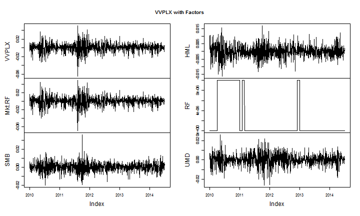

# SelectionShare & TimingShare


<style>
body{
  font-family: 'Oxygen', sans-serif;
  font-size: 15px;
  line-height: 22px;
}

h1,h2,h3,h4 {
  font-family: 'Raleway', sans-serif;
}

</style>


[Petajisto and Cremers' (2009)](ssrn.com/abstract=891719) ActiveShare and Tracking Error decomposition of money manager returns made what I consider to be revolutionary discoveries, but unfortunately are incredibly costly/difficult to calculate on mutual funds since they require holdings-level data.  In his latest two papers, [Anders Ekholm](www.andersekholm.fi) demonstrates how to similarly decompose performance armed only with the return stream of the manager.  His SelectionShare and TimingShare metrics are both an ingenious standalone contribution and a valuable indirect replication/validation of Petajisto/Cremers.  In case my ability to reword/summarize is not sufficient, I'll include the following quote from Ekholm summarizing the research.

<blockquote style='font-size:90%;margin-left:50px'>
"Cremers and Petajisto (2009) and Petajisto (2013) find that past ActiveShare is positively related to future performance. Ekholm (2012) takes a different approach and shows that the excess risk caused by selectivity and timing can be estimated from portfolio returns...
<br/><br/>
We develop the methodology presented by Ekholm (2012) one step further, and present two
new measures that quantify how much selectivity and timing have contributed to total variance.
Our SelectionShare and TimingShare measures can be estimated using portfolio returns only, which has both theoretical and practical advantages. Our empirical tests show that all active risk is not equal, as selectivity and timing have opposite effects on performance."
</blockquote>

Below with a little replicable R code, I will extend Ekholm's [example spreadsheet](http://www.andersekholm.fi/selection_timing/) to a real fund and calculate ActiveAlpha and ActiveBeta (2009 published 2012).  Then as Ekholm does, use these ActiveAlpha and ActiveBeta metrics to get SelectionShare and TimingShare (2014).  Since these calculations are just basic linear regression, I think it is well within the scope of nearly all readers' abilities.


---
# References in Code Comments

I am not sure that this will be helpful, and I have not done this in the past, but I will include references to the research within code comments.  For someone reading the code and not the content, this will insure that these links do not get lost.


```r
# perform Ekholm (2012,2014) analysis on mutual fund return data

# Ekholm, A.G., 2012
# Portfolio returns and manager activity:
#    How to decompose tracking error into security selection and market timing
# Journal of Empirical Finance, Volume 19, pp 349-€“358

# Ekholm, Anders G., July 21, 2014
# Components of Portfolio Variance:
#    R2, SelectionShare and TimingShare
# Available at SSRN: http://ssrn.com/abstract=2463649
```

---
# Depend on Other R Packages

We will, as always, depend on the wonderful and generous contributions of others in the form of R packages.  Most of the calculations though are just the base `lm(...)`.  I do not think there is any turning back from the pipes in [`magrittr`](cran.r-project.org/package=magrittr) or [`pipeR`](renkun.me/pipeR-tutorial/), and since I am addicted I will afford myself the luxury of pipes.


```r
library(quantmod)
library(PerformanceAnalytics)
library(tidyr)
# love me some pipes; will happily translate if pipes aren't your thing
library(pipeR)
#devtools::install_github("ramnathv/rCharts")
library(rCharts)
```

---
# Ugly Way to Get Kenneth French Factor Data

Get the full set of Fama/French factors from the very generous [Kenneth French data library](mba.tuck.dartmouth.edu/pages/faculty/ken.french/data_library.html).  This example only performs a Jensen regression, so we will only need the `Mkt.RF`.  However, in future installments, we will do the Carhart regression which requires the full factor set.  I'll accept full blame for the ugliness in this code.


```r
#daily factors from Kenneth French Data Library
#get Mkt.RF, SMB, HML, and RF
#UMD is in a different file
my.url="http://mba.tuck.dartmouth.edu/pages/faculty/ken.french/ftp/F-F_Research_Data_Factors_daily.zip"
my.tempfile<-paste(tempdir(),"\\frenchfactors.zip",sep="")
paste(tempdir(),"\\F-F_Research_Data_Factors_daily.txt",sep="") %>>%
  (~ download.file( my.url, my.tempfile, method="auto", 
              quiet = FALSE, mode = "wb",cacheOK = TRUE )
  ) %>>%
  (~ unzip(my.tempfile,exdir=tempdir(),junkpath=TRUE ) ) %>>%
  (
    #read space delimited text file extracted from zip
    read.table(file= . ,header = TRUE, sep = "", as.is = TRUE,
                 skip = 4, nrows=23257)
  ) %>>%
  (
    as.xts( ., order.by=as.Date(rownames(.),format="%Y%m%d" ) )
  ) -> french_factors_xts

#now get the momentum factor
my.url="http://mba.tuck.dartmouth.edu/pages/faculty/ken.french/ftp/F-F_Momentum_Factor_daily.zip"
my.usefile<-paste(tempdir(),"\\F-F_Momentum_Factor_daily.txt",sep="")
download.file(my.url, my.tempfile, method="auto", 
              quiet = FALSE, mode = "wb",cacheOK = TRUE)
unzip(my.tempfile,exdir=tempdir(),junkpath=TRUE)
#read space delimited text file extracted from zip
read.table(file=my.usefile, header = TRUE, sep = "",
              as.is = TRUE, skip = 13, nrows=23156) %>>%
  ( #get xts for analysis    
    as.xts( . , order.by=as.Date( rownames(.), format="%Y%m%d"  ) )
  ) %>>%
  #merge UMD (momentum) with other french factors
  ( merge( french_factors_xts, . ) )  %>>%
  na.omit %>>%
  ( .[] / 100 ) %>>%
  (~ plot.zoo(.) ) -> french_factors_xts
```

---
# Get Fund Data from Yahoo! Finance

`getSymbols` and [Yahoo! Finance](http://finance.yahoo.com) is certainly far cheaper than a subscription to CRSP.  Since I am in Alabama, I'll choose the largest mutual fund complex in the state [Vulcan Value Partners](http://vulcanvaluepartners.com/) for this example.  I am in no way affiliated with Vulcan Value nor should this post in any way be considered a recommendation of the fund.  However, for those who would like to know more, Barrons' recently did a profile of Vulcan [Waiting to Strike](http://online.barrons.com/news/articles/SB50001424053111904780504580051403072001336).


```r
#get a fund to analyze
# will use Vulcan Value the biggest mutual fund complex in Alabama
ticker <- 'VVPLX'
ticker %>>% 
  getSymbols( from="1896-01-01", adjust=TRUE, auto.assign=F ) %>>%
  ( .[,4] ) %>>%
  ROC( type = "discrete", n = 1 ) %>>%
  merge ( french_factors_xts ) %>>%
  na.omit -> perfComp

colnames(perfComp)[1] <- gsub( ".Close", "", colnames(perfComp)[1] )
# reasonableness check - plot the fund and factor returns
cumprod(1+perfComp) %>>% plot.zoo ( main = paste0(ticker, " & Factors | Cumulative Returns" ) )
```

 


---
# Calculate Ekholm's SelectionShare and TimingShare

Finally, we can actually calculate Ekholm's SelectionShare and TimingShare.  I will try to break it down into simple, easy-to-understand steps.

- Do a Jensen linear regression on fund returns versus the market less risk-free returns.


```r
# do it with lots of comments and no pipes
# to clarify the steps

# 1.  Linear Regression of Fund Return vs (Market - RiskFree)
#      which gives us the well-known Jensen alpha and beta
jensenLM <- lm( data = perfComp, VVPLX ~ Mkt.RF )
```


- Our linear regression will leave us with some residuals.  We will try to explain these residuals by running another linear regression this time on the residuals squared verses the market - riskfree squared.


```r
# 2.  Run another linear regression on the residuals ^2
#       vs the (Mkt - Rf)^2
residuals.df <- data.frame(
  residuals = as.numeric( residuals( jensenLM ) ) ^ 2
  , Mkt.RF_sq = as.numeric( perfComp$Mkt.RF ^ 2 )
)
residualsLM <- lm(
  data = residuals.df
  , residuals.df$residuals ~ residuals.df$Mkt.RF_sq
)
```

- ActiveAlpha and ActiveBeta will be the square root of the coefficients from the second linear regression.


```r
# 3. Get ActiveAlpha and ActiveBeta from coefficients
#     see
# Ekholm, A.G., 2012
# Portfolio returns and manager activity:
#    How to decompose tracking error into security selection and market timing
# Journal of Empirical Finance, Volume 19, pp 349-€“358
activeAlpha = coefficients( residualsLM )[1] ^ (1/2)
activeBeta = coefficients( residualsLM )[2] ^ (1/2)
```

- We now have all we need to calculate SelectionShare and TimingShare (see equations 10 and 11 in the paper for a full discussion).


```r
# 4. Last step to calculate SelectionShare and TimingShare
selectionShare = as.numeric(activeAlpha ^ 2 /
                    (
                      var( perfComp$VVPLX ) *
                      (nrow( perfComp ) - 1) / nrow( perfComp )
                    )
                  )

timingShare = as.numeric( activeBeta ^ 2 *
                mean( residuals.df$Mkt.RF_sq ) /
                (
                  var( perfComp$VVPLX ) *
                    ( nrow( perfComp ) - 1) / nrow( perfComp )
                )
              )
```

We have now accomplished our mission.  To check that we have not messed up, we can verify the identity (equation 12) and make sure that `r^2 + SelectionShare + TimingShare = 1`.  In effect, this says we have now fully explained the fund returns.


```r
# check our work r^2  + selectionShare + timingShare should equal 1
summary(jensenLM)$"r.squared" + selectionShare + timingShare
```

[1] 1

---
# One-liner with Function

I expect to use this Ekholm decomposition a lot, and I hope you will too. To make it easier, I'll make a simple function that will allow us to do the calculations in one-line and also do rolling decompositions.


```r
# return a list with
# 1. a data.frame of ActiveAlpha, ActiveBeta, SelectionShare, and TimingShare
# 2. the first linear regression
jensen_ekholm <- function( data, ticker = NULL ){
  
  if(is.null(ticker)) ticker <- colnames(data)[1]
  
  as.formula ( paste0(ticker, " ~  Mkt.RF" ) ) %>>%
    ( lm( data = data, . ) -> jensenLM )
  
  jensenLM %>>%
    residuals %>>%
    (. ^ 2 ) %>>%
    (
      data.frame(
        data
        , "fitted_sq" = .
        , lapply(data[,2],function(x){
          structure(
            data.frame( as.numeric(x) ^ 2 )
            , names = paste0(names(x),"_sq")
          ) %>>%
            return
        }) %>>% ( do.call( cbind, . ) )
      ) -> return_data_jensen
    )
  
  return_data_jensen %>>%
    ( lm( fitted_sq ~ Mkt.RF_sq, data = . ) )%>>%
    coefficients %>>%
    ( . ^ (1/2) ) %>>%
    t %>>%
    (
      structure(
        data.frame(.),
        names = c("ActiveAlpha", paste0("ActiveBeta_",colnames(.)[-1]))
      )
    ) %>>% 
    (
      data.frame(
        .
        , "SelectionShare" = .$ActiveAlpha ^ 2 / (var(return_data_jensen[,ticker]) * (nrow(return_data_jensen) - 1) / nrow(return_data_jensen))
        , "TimingShare" = .$ActiveBeta_Mkt.RF_sq ^ 2* mean( return_data_jensen$Mkt.RF_sq ) / (var(return_data_jensen[,ticker]) * (nrow(return_data_jensen) - 1) / nrow(return_data_jensen))
      )
    ) %>>%
    (
      list( "ekholm" = ., "linmod" = jensenLM )
    ) %>>%
    return
}
```

We should probably check that our new function generates the same result as our previous calculations.


```r
jensen_ekholm( perfComp ) -> jE

jE$ekholm$TimingShare ==  timingShare %>>%
  (~cat(c(
    "<p style='color:", ifelse(.,"green","red"), ";font-size:70%'>Does "
    ,jE$ekholm$SelectionShare
    , " == "
    , selectionShare
    ,"?</p>"
  ))) %>>% as.character
```

<p style='color: green ;font-size:70%'>Does  0.0642685566207194  ==  0.0642685566207194 ?</p>[1] TRUE

```r
jE$ekholm$TimingShare ==  timingShare %>>%
  (~cat(c(
    "<p style='color:", ifelse(.,"green","red"), ";font-size:70%'>Does "
    ,jE$ekholm$TimingShare
    , " == "
    , timingShare
    ,"?</p>"
  ))) %>>% as.character
```

<p style='color: green ;font-size:70%'>Does  0.00151247202235295  ==  0.00151247202235295 ?</p>[1] TRUE

```r
#as another check, this should equal 1
#jE %>>% ( summary(.$linmod)$"r.squared" + jE$ekholm[1,3] + jE$ekholm[1,4] )
```

---
# Rolling Ekholm Decomposition

In finance, it is almost always more fun and instructive to do functions on a rolling basis.  A rolling Ekholm decomposition is easy now with our new function `jensen_ekholm`.


<div id = 'rollingChart' style = 'height:450px;'></div>


```r
perfComp %>>%
  rollapply (
    FUN= function(x){
      x %>>%
        jensen_ekholm %>>% 
        ( data.frame( summary(.[["linmod"]])$"r.squared" , .$ekholm ) )  %>>%
        xts(order.by=tail(index(x),1)) -> return_df
      colnames(return_df)[1] <- "R_sq"
      return(return_df)
    }
    , width = 500
    #, by = 100
    , by.column=F
    , fill = NULL
  ) %>>%
  na.fill(0) %>>%
  ( data.frame(date=as.numeric(index(.)),.) ) -> rolling_ekholm

  rolling_ekholm[,c(1,2,5,6)] %>>%
    gather(source,value,-date) %>>%
    (nPlot(
      x = "date"
      , y = "value"
      , group = "source"
      , data = .
      , type = "stackedAreaChart"
      , dom = "rollingChart"
    )) %>>%
    (~ .$xAxis(
      tickFormat = "#!function(d){ return d3.time.format('%b %Y')(new Date( d * 24 * 60 * 60 * 1000 ))}!#"
    ) ) %>>%
    (~ .$chart( useInteractiveGuideline = T ) ) %>>%
    ( cat(noquote(.$html())) )
```

<script type='text/javascript'>
 $(document).ready(function(){
      drawrollingChart()
    });
    function drawrollingChart(){  
      var opts = {
 "dom": "rollingChart",
"width":    800,
"height":    400,
"x": "date",
"y": "value",
"group": "source",
"type": "stackedAreaChart",
"id": "rollingChart" 
},
        data = [
 {
 "date":          15330,
"source": "R_sq",
"value": 0.9483683167328 
},
{
 "date":          15331,
"source": "R_sq",
"value": 0.9481007762073 
},
{
 "date":          15335,
"source": "R_sq",
"value": 0.9482243726238 
},
{
 "date":          15336,
"source": "R_sq",
"value": 0.9483198088091 
},
{
 "date":          15337,
"source": "R_sq",
"value": 0.9487115993938 
},
{
 "date":          15338,
"source": "R_sq",
"value": 0.9487169186326 
},
{
 "date":          15342,
"source": "R_sq",
"value": 0.9486722482059 
},
{
 "date":          15343,
"source": "R_sq",
"value": 0.9486566456534 
},
{
 "date":          15344,
"source": "R_sq",
"value": 0.9488300386896 
},
{
 "date":          15345,
"source": "R_sq",
"value": 0.9487658814438 
},
{
 "date":          15348,
"source": "R_sq",
"value": 0.9487308427888 
},
{
 "date":          15349,
"source": "R_sq",
"value": 0.9488455912796 
},
{
 "date":          15350,
"source": "R_sq",
"value": 0.9484936588097 
},
{
 "date":          15351,
"source": "R_sq",
"value": 0.9483381151248 
},
{
 "date":          15352,
"source": "R_sq",
"value": 0.9481906467725 
},
{
 "date":          15356,
"source": "R_sq",
"value": 0.947893458832 
},
{
 "date":          15357,
"source": "R_sq",
"value": 0.9479520123762 
},
{
 "date":          15358,
"source": "R_sq",
"value": 0.9479405931693 
},
{
 "date":          15359,
"source": "R_sq",
"value": 0.9475762457897 
},
{
 "date":          15362,
"source": "R_sq",
"value": 0.9477679077079 
},
{
 "date":          15363,
"source": "R_sq",
"value": 0.9476895556737 
},
{
 "date":          15364,
"source": "R_sq",
"value": 0.9478678633709 
},
{
 "date":          15365,
"source": "R_sq",
"value": 0.9474805716024 
},
{
 "date":          15366,
"source": "R_sq",
"value": 0.9475090394578 
},
{
 "date":          15369,
"source": "R_sq",
"value": 0.9469092487297 
},
{
 "date":          15370,
"source": "R_sq",
"value": 0.9473351668337 
},
{
 "date":          15371,
"source": "R_sq",
"value": 0.9472885006162 
},
{
 "date":          15372,
"source": "R_sq",
"value": 0.9471845138043 
},
{
 "date":          15373,
"source": "R_sq",
"value": 0.947085106576 
},
{
 "date":          15376,
"source": "R_sq",
"value": 0.9473279813026 
},
{
 "date":          15377,
"source": "R_sq",
"value": 0.9473143399294 
},
{
 "date":          15378,
"source": "R_sq",
"value": 0.9472078725769 
},
{
 "date":          15379,
"source": "R_sq",
"value": 0.9474553850511 
},
{
 "date":          15380,
"source": "R_sq",
"value": 0.9475864661492 
},
{
 "date":          15383,
"source": "R_sq",
"value": 0.9476456596796 
},
{
 "date":          15384,
"source": "R_sq",
"value": 0.9476410075463 
},
{
 "date":          15385,
"source": "R_sq",
"value": 0.9477851597967 
},
{
 "date":          15386,
"source": "R_sq",
"value": 0.9478567878622 
},
{
 "date":          15387,
"source": "R_sq",
"value": 0.947855677016 
},
{
 "date":          15391,
"source": "R_sq",
"value": 0.9478042356117 
},
{
 "date":          15392,
"source": "R_sq",
"value": 0.9477118927514 
},
{
 "date":          15393,
"source": "R_sq",
"value": 0.9476804581104 
},
{
 "date":          15394,
"source": "R_sq",
"value": 0.9476517548191 
},
{
 "date":          15397,
"source": "R_sq",
"value": 0.9480147104773 
},
{
 "date":          15398,
"source": "R_sq",
"value": 0.9478066388813 
},
{
 "date":          15399,
"source": "R_sq",
"value": 0.9477678941086 
},
{
 "date":          15400,
"source": "R_sq",
"value": 0.9477940787508 
},
{
 "date":          15401,
"source": "R_sq",
"value": 0.9477944315818 
},
{
 "date":          15404,
"source": "R_sq",
"value": 0.9477816387032 
},
{
 "date":          15405,
"source": "R_sq",
"value": 0.9478071902268 
},
{
 "date":          15406,
"source": "R_sq",
"value": 0.947877703834 
},
{
 "date":          15407,
"source": "R_sq",
"value": 0.9479084023932 
},
{
 "date":          15408,
"source": "R_sq",
"value": 0.9477959845578 
},
{
 "date":          15411,
"source": "R_sq",
"value": 0.9479153800824 
},
{
 "date":          15412,
"source": "R_sq",
"value": 0.9479580033752 
},
{
 "date":          15413,
"source": "R_sq",
"value": 0.9479631124868 
},
{
 "date":          15414,
"source": "R_sq",
"value": 0.9480922261437 
},
{
 "date":          15415,
"source": "R_sq",
"value": 0.9481408671221 
},
{
 "date":          15418,
"source": "R_sq",
"value": 0.9484647887092 
},
{
 "date":          15419,
"source": "R_sq",
"value": 0.9484446225321 
},
{
 "date":          15420,
"source": "R_sq",
"value": 0.9485221829555 
},
{
 "date":          15421,
"source": "R_sq",
"value": 0.9486337110436 
},
{
 "date":          15422,
"source": "R_sq",
"value": 0.9486470734144 
},
{
 "date":          15425,
"source": "R_sq",
"value": 0.9487447023046 
},
{
 "date":          15426,
"source": "R_sq",
"value": 0.9489680383144 
},
{
 "date":          15427,
"source": "R_sq",
"value": 0.9489827062274 
},
{
 "date":          15428,
"source": "R_sq",
"value": 0.9489613985249 
},
{
 "date":          15429,
"source": "R_sq",
"value": 0.9489588111594 
},
{
 "date":          15432,
"source": "R_sq",
"value": 0.948943894675 
},
{
 "date":          15433,
"source": "R_sq",
"value": 0.9489706031931 
},
{
 "date":          15434,
"source": "R_sq",
"value": 0.9491599848085 
},
{
 "date":          15435,
"source": "R_sq",
"value": 0.9491435464779 
},
{
 "date":          15439,
"source": "R_sq",
"value": 0.9491869071086 
},
{
 "date":          15440,
"source": "R_sq",
"value": 0.9492626342484 
},
{
 "date":          15441,
"source": "R_sq",
"value": 0.9493049763546 
},
{
 "date":          15442,
"source": "R_sq",
"value": 0.9493842527432 
},
{
 "date":          15443,
"source": "R_sq",
"value": 0.9494750131081 
},
{
 "date":          15446,
"source": "R_sq",
"value": 0.9498418984307 
},
{
 "date":          15447,
"source": "R_sq",
"value": 0.9500147615469 
},
{
 "date":          15448,
"source": "R_sq",
"value": 0.9499772608774 
},
{
 "date":          15449,
"source": "R_sq",
"value": 0.9496833870262 
},
{
 "date":          15450,
"source": "R_sq",
"value": 0.9497200456533 
},
{
 "date":          15453,
"source": "R_sq",
"value": 0.9497032873919 
},
{
 "date":          15454,
"source": "R_sq",
"value": 0.9495970450814 
},
{
 "date":          15455,
"source": "R_sq",
"value": 0.9495654252555 
},
{
 "date":          15456,
"source": "R_sq",
"value": 0.9491771903666 
},
{
 "date":          15457,
"source": "R_sq",
"value": 0.949126996249 
},
{
 "date":          15460,
"source": "R_sq",
"value": 0.9483494112708 
},
{
 "date":          15461,
"source": "R_sq",
"value": 0.948310252215 
},
{
 "date":          15462,
"source": "R_sq",
"value": 0.9475225787356 
},
{
 "date":          15463,
"source": "R_sq",
"value": 0.9476019515838 
},
{
 "date":          15464,
"source": "R_sq",
"value": 0.9477523893961 
},
{
 "date":          15467,
"source": "R_sq",
"value": 0.9477167164152 
},
{
 "date":          15468,
"source": "R_sq",
"value": 0.947483942999 
},
{
 "date":          15469,
"source": "R_sq",
"value": 0.9477126233284 
},
{
 "date":          15470,
"source": "R_sq",
"value": 0.9475542502911 
},
{
 "date":          15471,
"source": "R_sq",
"value": 0.9475163754936 
},
{
 "date":          15474,
"source": "R_sq",
"value": 0.9468438560757 
},
{
 "date":          15475,
"source": "R_sq",
"value": 0.9468954747844 
},
{
 "date":          15476,
"source": "R_sq",
"value": 0.9471614119369 
},
{
 "date":          15477,
"source": "R_sq",
"value": 0.9471616359055 
},
{
 "date":          15478,
"source": "R_sq",
"value": 0.9471812806448 
},
{
 "date":          15481,
"source": "R_sq",
"value": 0.9469678201997 
},
{
 "date":          15482,
"source": "R_sq",
"value": 0.9467379548372 
},
{
 "date":          15483,
"source": "R_sq",
"value": 0.9474642286538 
},
{
 "date":          15484,
"source": "R_sq",
"value": 0.9473312352358 
},
{
 "date":          15485,
"source": "R_sq",
"value": 0.9473618323792 
},
{
 "date":          15489,
"source": "R_sq",
"value": 0.9466635338943 
},
{
 "date":          15490,
"source": "R_sq",
"value": 0.9466489290086 
},
{
 "date":          15491,
"source": "R_sq",
"value": 0.946958843998 
},
{
 "date":          15492,
"source": "R_sq",
"value": 0.9474021562965 
},
{
 "date":          15495,
"source": "R_sq",
"value": 0.9466840955929 
},
{
 "date":          15496,
"source": "R_sq",
"value": 0.946807371194 
},
{
 "date":          15497,
"source": "R_sq",
"value": 0.9469890973623 
},
{
 "date":          15498,
"source": "R_sq",
"value": 0.9464922971017 
},
{
 "date":          15499,
"source": "R_sq",
"value": 0.9462957509592 
},
{
 "date":          15502,
"source": "R_sq",
"value": 0.9464100427396 
},
{
 "date":          15503,
"source": "R_sq",
"value": 0.9470186330698 
},
{
 "date":          15504,
"source": "R_sq",
"value": 0.9470023213097 
},
{
 "date":          15505,
"source": "R_sq",
"value": 0.9468166038591 
},
{
 "date":          15506,
"source": "R_sq",
"value": 0.946942948599 
},
{
 "date":          15509,
"source": "R_sq",
"value": 0.9467381987937 
},
{
 "date":          15510,
"source": "R_sq",
"value": 0.9470848591642 
},
{
 "date":          15511,
"source": "R_sq",
"value": 0.9470864163474 
},
{
 "date":          15512,
"source": "R_sq",
"value": 0.9467460644953 
},
{
 "date":          15513,
"source": "R_sq",
"value": 0.9468648620922 
},
{
 "date":          15516,
"source": "R_sq",
"value": 0.9472550060055 
},
{
 "date":          15517,
"source": "R_sq",
"value": 0.9472498387629 
},
{
 "date":          15518,
"source": "R_sq",
"value": 0.9472287787278 
},
{
 "date":          15519,
"source": "R_sq",
"value": 0.9466832216536 
},
{
 "date":          15520,
"source": "R_sq",
"value": 0.9470215775626 
},
{
 "date":          15523,
"source": "R_sq",
"value": 0.9468218373801 
},
{
 "date":          15524,
"source": "R_sq",
"value": 0.946906480016 
},
{
 "date":          15526,
"source": "R_sq",
"value": 0.946709015538 
},
{
 "date":          15527,
"source": "R_sq",
"value": 0.9469107429941 
},
{
 "date":          15530,
"source": "R_sq",
"value": 0.9466148570317 
},
{
 "date":          15531,
"source": "R_sq",
"value": 0.9461523683589 
},
{
 "date":          15532,
"source": "R_sq",
"value": 0.9462293178587 
},
{
 "date":          15533,
"source": "R_sq",
"value": 0.9462122739143 
},
{
 "date":          15534,
"source": "R_sq",
"value": 0.9462350251847 
},
{
 "date":          15537,
"source": "R_sq",
"value": 0.9461078296823 
},
{
 "date":          15538,
"source": "R_sq",
"value": 0.9460521008219 
},
{
 "date":          15539,
"source": "R_sq",
"value": 0.9460530203517 
},
{
 "date":          15540,
"source": "R_sq",
"value": 0.9460496246535 
},
{
 "date":          15541,
"source": "R_sq",
"value": 0.9461469114125 
},
{
 "date":          15544,
"source": "R_sq",
"value": 0.9462534110891 
},
{
 "date":          15545,
"source": "R_sq",
"value": 0.9468710563475 
},
{
 "date":          15546,
"source": "R_sq",
"value": 0.9467776837701 
},
{
 "date":          15547,
"source": "R_sq",
"value": 0.9468160996771 
},
{
 "date":          15548,
"source": "R_sq",
"value": 0.947016834579 
},
{
 "date":          15551,
"source": "R_sq",
"value": 0.9469119721842 
},
{
 "date":          15552,
"source": "R_sq",
"value": 0.9469208304134 
},
{
 "date":          15553,
"source": "R_sq",
"value": 0.9469671009279 
},
{
 "date":          15554,
"source": "R_sq",
"value": 0.9471414591924 
},
{
 "date":          15555,
"source": "R_sq",
"value": 0.9471404553851 
},
{
 "date":          15558,
"source": "R_sq",
"value": 0.9473139689507 
},
{
 "date":          15559,
"source": "R_sq",
"value": 0.9466989730729 
},
{
 "date":          15560,
"source": "R_sq",
"value": 0.9467132196628 
},
{
 "date":          15561,
"source": "R_sq",
"value": 0.946613784473 
},
{
 "date":          15562,
"source": "R_sq",
"value": 0.9465716911038 
},
{
 "date":          15565,
"source": "R_sq",
"value": 0.9463405123184 
},
{
 "date":          15566,
"source": "R_sq",
"value": 0.9463129200104 
},
{
 "date":          15567,
"source": "R_sq",
"value": 0.9462969027896 
},
{
 "date":          15568,
"source": "R_sq",
"value": 0.9456351182961 
},
{
 "date":          15569,
"source": "R_sq",
"value": 0.9456642737119 
},
{
 "date":          15572,
"source": "R_sq",
"value": 0.945603340558 
},
{
 "date":          15573,
"source": "R_sq",
"value": 0.945612767397 
},
{
 "date":          15574,
"source": "R_sq",
"value": 0.9459393022336 
},
{
 "date":          15575,
"source": "R_sq",
"value": 0.9460535916573 
},
{
 "date":          15576,
"source": "R_sq",
"value": 0.9458407426943 
},
{
 "date":          15579,
"source": "R_sq",
"value": 0.9458024407682 
},
{
 "date":          15580,
"source": "R_sq",
"value": 0.9456718813869 
},
{
 "date":          15581,
"source": "R_sq",
"value": 0.9455680509851 
},
{
 "date":          15582,
"source": "R_sq",
"value": 0.9456718562814 
},
{
 "date":          15583,
"source": "R_sq",
"value": 0.9459369212414 
},
{
 "date":          15587,
"source": "R_sq",
"value": 0.9460903154039 
},
{
 "date":          15588,
"source": "R_sq",
"value": 0.9465867484776 
},
{
 "date":          15589,
"source": "R_sq",
"value": 0.9470189484398 
},
{
 "date":          15590,
"source": "R_sq",
"value": 0.9472993710706 
},
{
 "date":          15593,
"source": "R_sq",
"value": 0.9472395083734 
},
{
 "date":          15594,
"source": "R_sq",
"value": 0.9473249795031 
},
{
 "date":          15595,
"source": "R_sq",
"value": 0.9471636787882 
},
{
 "date":          15596,
"source": "R_sq",
"value": 0.9473006803622 
},
{
 "date":          15597,
"source": "R_sq",
"value": 0.9473435876962 
},
{
 "date":          15600,
"source": "R_sq",
"value": 0.9473964370534 
},
{
 "date":          15601,
"source": "R_sq",
"value": 0.9471672455156 
},
{
 "date":          15602,
"source": "R_sq",
"value": 0.947164455343 
},
{
 "date":          15603,
"source": "R_sq",
"value": 0.9471454005884 
},
{
 "date":          15604,
"source": "R_sq",
"value": 0.947140404792 
},
{
 "date":          15607,
"source": "R_sq",
"value": 0.9471669607076 
},
{
 "date":          15608,
"source": "R_sq",
"value": 0.9474852111828 
},
{
 "date":          15609,
"source": "R_sq",
"value": 0.947877774503 
},
{
 "date":          15610,
"source": "R_sq",
"value": 0.9476595931853 
},
{
 "date":          15611,
"source": "R_sq",
"value": 0.948130374438 
},
{
 "date":          15614,
"source": "R_sq",
"value": 0.9481197535719 
},
{
 "date":          15615,
"source": "R_sq",
"value": 0.9480754604343 
},
{
 "date":          15616,
"source": "R_sq",
"value": 0.9481645946836 
},
{
 "date":          15617,
"source": "R_sq",
"value": 0.9481749039184 
},
{
 "date":          15618,
"source": "R_sq",
"value": 0.9481661031001 
},
{
 "date":          15621,
"source": "R_sq",
"value": 0.9483113706572 
},
{
 "date":          15622,
"source": "R_sq",
"value": 0.9496153048098 
},
{
 "date":          15623,
"source": "R_sq",
"value": 0.9496308805086 
},
{
 "date":          15624,
"source": "R_sq",
"value": 0.9499253368138 
},
{
 "date":          15625,
"source": "R_sq",
"value": 0.9498363041012 
},
{
 "date":          15628,
"source": "R_sq",
"value": 0.9499641810014 
},
{
 "date":          15629,
"source": "R_sq",
"value": 0.9502114675852 
},
{
 "date":          15630,
"source": "R_sq",
"value": 0.9502959685366 
},
{
 "date":          15631,
"source": "R_sq",
"value": 0.9501224289647 
},
{
 "date":          15632,
"source": "R_sq",
"value": 0.9502497603217 
},
{
 "date":          15635,
"source": "R_sq",
"value": 0.9502939911187 
},
{
 "date":          15636,
"source": "R_sq",
"value": 0.9506925676008 
},
{
 "date":          15637,
"source": "R_sq",
"value": 0.9506981821761 
},
{
 "date":          15638,
"source": "R_sq",
"value": 0.9506349556099 
},
{
 "date":          15639,
"source": "R_sq",
"value": 0.9506710756649 
},
{
 "date":          15644,
"source": "R_sq",
"value": 0.951553454683 
},
{
 "date":          15645,
"source": "R_sq",
"value": 0.9517409682655 
},
{
 "date":          15646,
"source": "R_sq",
"value": 0.9519504391351 
},
{
 "date":          15649,
"source": "R_sq",
"value": 0.9520224188641 
},
{
 "date":          15650,
"source": "R_sq",
"value": 0.952020186448 
},
{
 "date":          15651,
"source": "R_sq",
"value": 0.9521487909216 
},
{
 "date":          15652,
"source": "R_sq",
"value": 0.9523698801099 
},
{
 "date":          15653,
"source": "R_sq",
"value": 0.9523677182518 
},
{
 "date":          15656,
"source": "R_sq",
"value": 0.9521938172312 
},
{
 "date":          15657,
"source": "R_sq",
"value": 0.9522543912952 
},
{
 "date":          15658,
"source": "R_sq",
"value": 0.951847902936 
},
{
 "date":          15659,
"source": "R_sq",
"value": 0.9518493510529 
},
{
 "date":          15660,
"source": "R_sq",
"value": 0.9518747982438 
},
{
 "date":          15663,
"source": "R_sq",
"value": 0.9519243399802 
},
{
 "date":          15664,
"source": "R_sq",
"value": 0.9520844812334 
},
{
 "date":          15665,
"source": "R_sq",
"value": 0.9520594044541 
},
{
 "date":          15667,
"source": "R_sq",
"value": 0.9521903609464 
},
{
 "date":          15670,
"source": "R_sq",
"value": 0.952299760792 
},
{
 "date":          15671,
"source": "R_sq",
"value": 0.9521521458736 
},
{
 "date":          15672,
"source": "R_sq",
"value": 0.9522858422296 
},
{
 "date":          15673,
"source": "R_sq",
"value": 0.9523038616795 
},
{
 "date":          15674,
"source": "R_sq",
"value": 0.9523111772445 
},
{
 "date":          15677,
"source": "R_sq",
"value": 0.9524522090803 
},
{
 "date":          15678,
"source": "R_sq",
"value": 0.9525188489782 
},
{
 "date":          15679,
"source": "R_sq",
"value": 0.9525498678904 
},
{
 "date":          15680,
"source": "R_sq",
"value": 0.9525938193144 
},
{
 "date":          15681,
"source": "R_sq",
"value": 0.952537012204 
},
{
 "date":          15684,
"source": "R_sq",
"value": 0.9526270800969 
},
{
 "date":          15685,
"source": "R_sq",
"value": 0.952502599179 
},
{
 "date":          15686,
"source": "R_sq",
"value": 0.9533516137134 
},
{
 "date":          15687,
"source": "R_sq",
"value": 0.9533236199369 
},
{
 "date":          15688,
"source": "R_sq",
"value": 0.9533996776192 
},
{
 "date":          15691,
"source": "R_sq",
"value": 0.9537731995872 
},
{
 "date":          15692,
"source": "R_sq",
"value": 0.9539138729694 
},
{
 "date":          15693,
"source": "R_sq",
"value": 0.9538262015412 
},
{
 "date":          15694,
"source": "R_sq",
"value": 0.9538313411156 
},
{
 "date":          15695,
"source": "R_sq",
"value": 0.9538559464575 
},
{
 "date":          15698,
"source": "R_sq",
"value": 0.9538596776327 
},
{
 "date":          15700,
"source": "R_sq",
"value": 0.9539178959149 
},
{
 "date":          15701,
"source": "R_sq",
"value": 0.9539284669484 
},
{
 "date":          15702,
"source": "R_sq",
"value": 0.9539185482598 
},
{
 "date":          15705,
"source": "R_sq",
"value": 0.9541008660555 
},
{
 "date":          15707,
"source": "R_sq",
"value": 0.954479358393 
},
{
 "date":          15708,
"source": "R_sq",
"value": 0.9545884731796 
},
{
 "date":          15709,
"source": "R_sq",
"value": 0.9546412645953 
},
{
 "date":          15712,
"source": "R_sq",
"value": 0.9546429585857 
},
{
 "date":          15713,
"source": "R_sq",
"value": 0.9547338975729 
},
{
 "date":          15714,
"source": "R_sq",
"value": 0.9548527942028 
},
{
 "date":          15715,
"source": "R_sq",
"value": 0.9548617315696 
},
{
 "date":          15716,
"source": "R_sq",
"value": 0.9549100935679 
},
{
 "date":          15719,
"source": "R_sq",
"value": 0.9549312639502 
},
{
 "date":          15720,
"source": "R_sq",
"value": 0.9552671535388 
},
{
 "date":          15721,
"source": "R_sq",
"value": 0.9553640535157 
},
{
 "date":          15722,
"source": "R_sq",
"value": 0.9554417156192 
},
{
 "date":          15723,
"source": "R_sq",
"value": 0.9553504189326 
},
{
 "date":          15727,
"source": "R_sq",
"value": 0.9554711516809 
},
{
 "date":          15728,
"source": "R_sq",
"value": 0.955491113585 
},
{
 "date":          15729,
"source": "R_sq",
"value": 0.9552095641067 
},
{
 "date":          15730,
"source": "R_sq",
"value": 0.9549526251864 
},
{
 "date":          15733,
"source": "R_sq",
"value": 0.9557258507255 
},
{
 "date":          15734,
"source": "R_sq",
"value": 0.9556501303718 
},
{
 "date":          15735,
"source": "R_sq",
"value": 0.9557953140494 
},
{
 "date":          15736,
"source": "R_sq",
"value": 0.9557535612566 
},
{
 "date":          15737,
"source": "R_sq",
"value": 0.9557881058269 
},
{
 "date":          15740,
"source": "R_sq",
"value": 0.9558279876837 
},
{
 "date":          15741,
"source": "R_sq",
"value": 0.9566381567403 
},
{
 "date":          15742,
"source": "R_sq",
"value": 0.9573269605405 
},
{
 "date":          15743,
"source": "R_sq",
"value": 0.9577051850858 
},
{
 "date":          15744,
"source": "R_sq",
"value": 0.9577784339757 
},
{
 "date":          15747,
"source": "R_sq",
"value": 0.9577829829394 
},
{
 "date":          15748,
"source": "R_sq",
"value": 0.9577846253754 
},
{
 "date":          15749,
"source": "R_sq",
"value":  0.95775580865 
},
{
 "date":          15750,
"source": "R_sq",
"value": 0.9576985289698 
},
{
 "date":          15751,
"source": "R_sq",
"value": 0.9577795368329 
},
{
 "date":          15755,
"source": "R_sq",
"value": 0.9575496788366 
},
{
 "date":          15756,
"source": "R_sq",
"value": 0.9576669227605 
},
{
 "date":          15757,
"source": "R_sq",
"value": 0.9576896179023 
},
{
 "date":          15758,
"source": "R_sq",
"value": 0.9579124733276 
},
{
 "date":          15761,
"source": "R_sq",
"value": 0.9580529041769 
},
{
 "date":          15762,
"source": "R_sq",
"value": 0.957873827984 
},
{
 "date":          15763,
"source": "R_sq",
"value": 0.9578748434668 
},
{
 "date":          15764,
"source": "R_sq",
"value": 0.9578013658009 
},
{
 "date":          15765,
"source": "R_sq",
"value": 0.9577174058551 
},
{
 "date":          15768,
"source": "R_sq",
"value": 0.9576737734577 
},
{
 "date":          15769,
"source": "R_sq",
"value": 0.9574722419036 
},
{
 "date":          15770,
"source": "R_sq",
"value": 0.9575331683524 
},
{
 "date":          15771,
"source": "R_sq",
"value": 0.9573316908806 
},
{
 "date":          15772,
"source": "R_sq",
"value": 0.9575761809246 
},
{
 "date":          15775,
"source": "R_sq",
"value": 0.9575852014386 
},
{
 "date":          15776,
"source": "R_sq",
"value": 0.9574024163073 
},
{
 "date":          15777,
"source": "R_sq",
"value": 0.9571908042458 
},
{
 "date":          15778,
"source": "R_sq",
"value": 0.9572076507139 
},
{
 "date":          15779,
"source": "R_sq",
"value": 0.9573341772817 
},
{
 "date":          15782,
"source": "R_sq",
"value": 0.9572363449557 
},
{
 "date":          15783,
"source": "R_sq",
"value": 0.957215282264 
},
{
 "date":          15784,
"source": "R_sq",
"value": 0.9572297622728 
},
{
 "date":          15785,
"source": "R_sq",
"value": 0.9569425868462 
},
{
 "date":          15786,
"source": "R_sq",
"value": 0.9571942589826 
},
{
 "date":          15789,
"source": "R_sq",
"value": 0.9572296132957 
},
{
 "date":          15790,
"source": "R_sq",
"value": 0.9570894804437 
},
{
 "date":          15791,
"source": "R_sq",
"value": 0.9571330759233 
},
{
 "date":          15792,
"source": "R_sq",
"value": 0.9573865978472 
},
{
 "date":          15796,
"source": "R_sq",
"value": 0.9577293605339 
},
{
 "date":          15797,
"source": "R_sq",
"value": 0.9575123212633 
},
{
 "date":          15798,
"source": "R_sq",
"value": 0.9574474953061 
},
{
 "date":          15799,
"source": "R_sq",
"value": 0.9577460048154 
},
{
 "date":          15800,
"source": "R_sq",
"value": 0.9577326595622 
},
{
 "date":          15803,
"source": "R_sq",
"value": 0.9577479914404 
},
{
 "date":          15804,
"source": "R_sq",
"value": 0.9576876384246 
},
{
 "date":          15805,
"source": "R_sq",
"value": 0.9578392589534 
},
{
 "date":          15806,
"source": "R_sq",
"value": 0.9578978632382 
},
{
 "date":          15807,
"source": "R_sq",
"value": 0.9578076274795 
},
{
 "date":          15810,
"source": "R_sq",
"value": 0.958438849164 
},
{
 "date":          15811,
"source": "R_sq",
"value": 0.9584802531782 
},
{
 "date":          15812,
"source": "R_sq",
"value": 0.9584975355239 
},
{
 "date":          15813,
"source": "R_sq",
"value": 0.9583989424162 
},
{
 "date":          15814,
"source": "R_sq",
"value": 0.9587601944223 
},
{
 "date":          15817,
"source": "R_sq",
"value": 0.9587322981536 
},
{
 "date":          15818,
"source": "R_sq",
"value": 0.9586912540425 
},
{
 "date":          15819,
"source": "R_sq",
"value": 0.9586706947484 
},
{
 "date":          15820,
"source": "R_sq",
"value": 0.9586655054042 
},
{
 "date":          15821,
"source": "R_sq",
"value": 0.9587319628246 
},
{
 "date":          15824,
"source": "R_sq",
"value": 0.9588641325925 
},
{
 "date":          15825,
"source": "R_sq",
"value": 0.958944577743 
},
{
 "date":          15826,
"source": "R_sq",
"value": 0.9591665821269 
},
{
 "date":          15827,
"source": "R_sq",
"value": 0.9591433700564 
},
{
 "date":          15828,
"source": "R_sq",
"value": 0.9591815614915 
},
{
 "date":          15831,
"source": "R_sq",
"value": 0.9592968407455 
},
{
 "date":          15832,
"source": "R_sq",
"value": 0.9590276928115 
},
{
 "date":          15833,
"source": "R_sq",
"value": 0.9590234448315 
},
{
 "date":          15834,
"source": "R_sq",
"value": 0.959017691404 
},
{
 "date":          15835,
"source": "R_sq",
"value": 0.9590193946026 
},
{
 "date":          15838,
"source": "R_sq",
"value": 0.9590837708008 
},
{
 "date":          15839,
"source": "R_sq",
"value": 0.9591409193445 
},
{
 "date":          15840,
"source": "R_sq",
"value": 0.9590302293983 
},
{
 "date":          15841,
"source": "R_sq",
"value": 0.9585843348124 
},
{
 "date":          15842,
"source": "R_sq",
"value": 0.9586023198946 
},
{
 "date":          15845,
"source": "R_sq",
"value": 0.9584901055757 
},
{
 "date":          15846,
"source": "R_sq",
"value": 0.9585933863641 
},
{
 "date":          15847,
"source": "R_sq",
"value": 0.9587146855533 
},
{
 "date":          15848,
"source": "R_sq",
"value": 0.9587456078594 
},
{
 "date":          15849,
"source": "R_sq",
"value": 0.9589147940283 
},
{
 "date":          15853,
"source": "R_sq",
"value": 0.9589228259641 
},
{
 "date":          15854,
"source": "R_sq",
"value": 0.9588279167496 
},
{
 "date":          15855,
"source": "R_sq",
"value": 0.958767681241 
},
{
 "date":          15856,
"source": "R_sq",
"value": 0.9589515323734 
},
{
 "date":          15859,
"source": "R_sq",
"value": 0.9589625571824 
},
{
 "date":          15860,
"source": "R_sq",
"value": 0.9589889097801 
},
{
 "date":          15861,
"source": "R_sq",
"value": 0.9590868026302 
},
{
 "date":          15862,
"source": "R_sq",
"value": 0.9589481715822 
},
{
 "date":          15863,
"source": "R_sq",
"value": 0.9589043486776 
},
{
 "date":          15866,
"source": "R_sq",
"value": 0.9588924740522 
},
{
 "date":          15867,
"source": "R_sq",
"value": 0.9590213319748 
},
{
 "date":          15868,
"source": "R_sq",
"value": 0.9589469504512 
},
{
 "date":          15869,
"source": "R_sq",
"value": 0.9590522082332 
},
{
 "date":          15870,
"source": "R_sq",
"value": 0.9591729936181 
},
{
 "date":          15873,
"source": "R_sq",
"value": 0.9591578887589 
},
{
 "date":          15874,
"source": "R_sq",
"value": 0.9591818316052 
},
{
 "date":          15875,
"source": "R_sq",
"value": 0.959213631106 
},
{
 "date":          15876,
"source": "R_sq",
"value": 0.9595690304115 
},
{
 "date":          15877,
"source": "R_sq",
"value": 0.9586555114154 
},
{
 "date":          15880,
"source": "R_sq",
"value": 0.9587599757538 
},
{
 "date":          15881,
"source": "R_sq",
"value": 0.9587410089691 
},
{
 "date":          15882,
"source": "R_sq",
"value": 0.9588399329252 
},
{
 "date":          15883,
"source": "R_sq",
"value": 0.9588205627972 
},
{
 "date":          15884,
"source": "R_sq",
"value": 0.9588402012107 
},
{
 "date":          15887,
"source": "R_sq",
"value": 0.958779159099 
},
{
 "date":          15888,
"source": "R_sq",
"value": 0.9589494032412 
},
{
 "date":          15889,
"source": "R_sq",
"value": 0.9588041313172 
},
{
 "date":          15891,
"source": "R_sq",
"value": 0.9588389804652 
},
{
 "date":          15894,
"source": "R_sq",
"value": 0.9585977417471 
},
{
 "date":          15895,
"source": "R_sq",
"value": 0.958572760343 
},
{
 "date":          15896,
"source": "R_sq",
"value": 0.9585782285863 
},
{
 "date":          15897,
"source": "R_sq",
"value": 0.9583717762514 
},
{
 "date":          15898,
"source": "R_sq",
"value": 0.9584029265295 
},
{
 "date":          15901,
"source": "R_sq",
"value": 0.958338603741 
},
{
 "date":          15902,
"source": "R_sq",
"value": 0.9582203623105 
},
{
 "date":          15903,
"source": "R_sq",
"value": 0.9583511299838 
},
{
 "date":          15904,
"source": "R_sq",
"value": 0.9582686438168 
},
{
 "date":          15905,
"source": "R_sq",
"value": 0.9584493924209 
},
{
 "date":          15908,
"source": "R_sq",
"value": 0.9586149027877 
},
{
 "date":          15909,
"source": "R_sq",
"value": 0.9588942023513 
},
{
 "date":          15910,
"source": "R_sq",
"value": 0.9584998737016 
},
{
 "date":          15911,
"source": "R_sq",
"value": 0.9586786582013 
},
{
 "date":          15912,
"source": "R_sq",
"value": 0.9588991463725 
},
{
 "date":          15915,
"source": "R_sq",
"value": 0.9589401200999 
},
{
 "date":          15916,
"source": "R_sq",
"value": 0.9585305524207 
},
{
 "date":          15917,
"source": "R_sq",
"value": 0.9594145254104 
},
{
 "date":          15918,
"source": "R_sq",
"value":   0.9587285866 
},
{
 "date":          15919,
"source": "R_sq",
"value": 0.9589641424377 
},
{
 "date":          15922,
"source": "R_sq",
"value": 0.9560782573195 
},
{
 "date":          15923,
"source": "R_sq",
"value": 0.9538658125553 
},
{
 "date":          15924,
"source": "R_sq",
"value": 0.9523873918539 
},
{
 "date":          15925,
"source": "R_sq",
"value": 0.9506533877127 
},
{
 "date":          15926,
"source": "R_sq",
"value": 0.9505783867725 
},
{
 "date":          15929,
"source": "R_sq",
"value": 0.951108704022 
},
{
 "date":          15930,
"source": "R_sq",
"value": 0.9513558340407 
},
{
 "date":          15931,
"source": "R_sq",
"value": 0.9516230315002 
},
{
 "date":          15932,
"source": "R_sq",
"value": 0.9499192392961 
},
{
 "date":          15933,
"source": "R_sq",
"value": 0.9509206136408 
},
{
 "date":          15936,
"source": "R_sq",
"value": 0.9508278456538 
},
{
 "date":          15937,
"source": "R_sq",
"value": 0.9499052493765 
},
{
 "date":          15938,
"source": "R_sq",
"value": 0.9496853581359 
},
{
 "date":          15939,
"source": "R_sq",
"value": 0.9493838941113 
},
{
 "date":          15940,
"source": "R_sq",
"value": 0.9488568123206 
},
{
 "date":          15943,
"source": "R_sq",
"value": 0.9482833150557 
},
{
 "date":          15944,
"source": "R_sq",
"value": 0.9485204188444 
},
{
 "date":          15945,
"source": "R_sq",
"value": 0.9485710023371 
},
{
 "date":          15946,
"source": "R_sq",
"value": 0.9488152856342 
},
{
 "date":          15947,
"source": "R_sq",
"value": 0.9484005328224 
},
{
 "date":          15951,
"source": "R_sq",
"value": 0.9483872117355 
},
{
 "date":          15952,
"source": "R_sq",
"value": 0.9481230776548 
},
{
 "date":          15953,
"source": "R_sq",
"value": 0.9484510829171 
},
{
 "date":          15954,
"source": "R_sq",
"value": 0.9476542812913 
},
{
 "date":          15957,
"source": "R_sq",
"value": 0.9478703751995 
},
{
 "date":          15958,
"source": "R_sq",
"value": 0.9477052480984 
},
{
 "date":          15959,
"source": "R_sq",
"value": 0.9473016546441 
},
{
 "date":          15960,
"source": "R_sq",
"value": 0.9469820727354 
},
{
 "date":          15961,
"source": "R_sq",
"value": 0.9470300952586 
},
{
 "date":          15964,
"source": "R_sq",
"value": 0.9471277598932 
},
{
 "date":          15965,
"source": "R_sq",
"value": 0.9481246777105 
},
{
 "date":          15966,
"source": "R_sq",
"value": 0.9473533354775 
},
{
 "date":          15967,
"source": "R_sq",
"value": 0.9461181900804 
},
{
 "date":          15968,
"source": "R_sq",
"value": 0.9462830214324 
},
{
 "date":          15971,
"source": "R_sq",
"value": 0.946393778298 
},
{
 "date":          15972,
"source": "R_sq",
"value": 0.9461324297065 
},
{
 "date":          15973,
"source": "R_sq",
"value": 0.9458327064418 
},
{
 "date":          15974,
"source": "R_sq",
"value": 0.9464869202823 
},
{
 "date":          15975,
"source": "R_sq",
"value": 0.9458203432673 
},
{
 "date":          15978,
"source": "R_sq",
"value": 0.9451616056119 
},
{
 "date":          15979,
"source": "R_sq",
"value": 0.9449248033668 
},
{
 "date":          15980,
"source": "R_sq",
"value": 0.9448159386885 
},
{
 "date":          15981,
"source": "R_sq",
"value": 0.9447396194144 
},
{
 "date":          15982,
"source": "R_sq",
"value": 0.9449917212247 
},
{
 "date":          15985,
"source": "R_sq",
"value": 0.9436630887294 
},
{
 "date":          15986,
"source": "R_sq",
"value": 0.9439928578614 
},
{
 "date":          15987,
"source": "R_sq",
"value": 0.9438889421109 
},
{
 "date":          15988,
"source": "R_sq",
"value": 0.9445028310122 
},
{
 "date":          15989,
"source": "R_sq",
"value": 0.9442356332099 
},
{
 "date":          15992,
"source": "R_sq",
"value": 0.9436663741874 
},
{
 "date":          15993,
"source": "R_sq",
"value": 0.9431704091921 
},
{
 "date":          15994,
"source": "R_sq",
"value": 0.9421119765585 
},
{
 "date":          15995,
"source": "R_sq",
"value": 0.9421726016443 
},
{
 "date":          15996,
"source": "R_sq",
"value": 0.9416118838034 
},
{
 "date":          15999,
"source": "R_sq",
"value": 0.9410066809552 
},
{
 "date":          16000,
"source": "R_sq",
"value": 0.9401858039788 
},
{
 "date":          16001,
"source": "R_sq",
"value": 0.9404574829595 
},
{
 "date":          16002,
"source": "R_sq",
"value": 0.9391267266449 
},
{
 "date":          16003,
"source": "R_sq",
"value": 0.9391297561003 
},
{
 "date":          16006,
"source": "R_sq",
"value": 0.9393773450432 
},
{
 "date":          16007,
"source": "R_sq",
"value": 0.9378863881322 
},
{
 "date":          16008,
"source": "R_sq",
"value": 0.9374837614861 
},
{
 "date":          16009,
"source": "R_sq",
"value": 0.9369390485566 
},
{
 "date":          16010,
"source": "R_sq",
"value": 0.9368890640382 
},
{
 "date":          16013,
"source": "R_sq",
"value": 0.936425003959 
},
{
 "date":          16014,
"source": "R_sq",
"value": 0.9362257365516 
},
{
 "date":          16015,
"source": "R_sq",
"value": 0.9336300672991 
},
{
 "date":          16016,
"source": "R_sq",
"value": 0.9339455036544 
},
{
 "date":          16017,
"source": "R_sq",
"value": 0.9335511405978 
},
{
 "date":          16020,
"source": "R_sq",
"value": 0.9333511254765 
},
{
 "date":          16021,
"source": "R_sq",
"value": 0.9330001560605 
},
{
 "date":          16022,
"source": "R_sq",
"value": 0.9326144993228 
},
{
 "date":          16023,
"source": "R_sq",
"value": 0.9314097837028 
},
{
 "date":          16024,
"source": "R_sq",
"value": 0.9313518586882 
},
{
 "date":          16027,
"source": "R_sq",
"value": 0.9304951535969 
},
{
 "date":          16028,
"source": "R_sq",
"value": 0.9306390721889 
},
{
 "date":          16029,
"source": "R_sq",
"value": 0.9295878578089 
},
{
 "date":          16030,
"source": "R_sq",
"value": 0.9297562030635 
},
{
 "date":          16031,
"source": "R_sq",
"value": 0.9281517841824 
},
{
 "date":          16034,
"source": "R_sq",
"value": 0.9283828983085 
},
{
 "date":          16035,
"source": "R_sq",
"value": 0.9249098267204 
},
{
 "date":          16036,
"source": "R_sq",
"value": 0.9248902236463 
},
{
 "date":          16038,
"source": "R_sq",
"value": 0.9247780464346 
},
{
 "date":          16041,
"source": "R_sq",
"value": 0.9252989049679 
},
{
 "date":          16042,
"source": "R_sq",
"value": 0.9253751369416 
},
{
 "date":          16043,
"source": "R_sq",
"value": 0.9253251601703 
},
{
 "date":          16044,
"source": "R_sq",
"value": 0.9243136585733 
},
{
 "date":          16045,
"source": "R_sq",
"value": 0.9238459953333 
},
{
 "date":          16048,
"source": "R_sq",
"value": 0.9234922857188 
},
{
 "date":          16049,
"source": "R_sq",
"value": 0.9235946107704 
},
{
 "date":          16050,
"source": "R_sq",
"value": 0.9226348929282 
},
{
 "date":          16051,
"source": "R_sq",
"value": 0.9221875660818 
},
{
 "date":          16052,
"source": "R_sq",
"value": 0.9223755083386 
},
{
 "date":          16055,
"source": "R_sq",
"value": 0.9219249832131 
},
{
 "date":          16056,
"source": "R_sq",
"value": 0.9197760010049 
},
{
 "date":          16057,
"source": "R_sq",
"value": 0.9207067292796 
},
{
 "date":          16058,
"source": "R_sq",
"value": 0.9198378190689 
},
{
 "date":          16059,
"source": "R_sq",
"value": 0.920037679253 
},
{
 "date":          16062,
"source": "R_sq",
"value": 0.9200211281446 
},
{
 "date":          16063,
"source": "R_sq",
"value": 0.919856736965 
},
{
 "date":          16065,
"source": "R_sq",
"value": 0.9196281722178 
},
{
 "date":          16066,
"source": "R_sq",
"value": 0.9193613979901 
},
{
 "date":          16069,
"source": "R_sq",
"value": 0.9187823454158 
},
{
 "date":          16070,
"source": "R_sq",
"value": 0.9194066256501 
},
{
 "date":          16072,
"source": "R_sq",
"value": 0.9193680421631 
},
{
 "date":          16073,
"source": "R_sq",
"value": 0.9193722904383 
},
{
 "date":          16076,
"source": "R_sq",
"value": 0.9195501911067 
},
{
 "date":          16077,
"source": "R_sq",
"value": 0.9187760903636 
},
{
 "date":          16078,
"source": "R_sq",
"value": 0.9195558089908 
},
{
 "date":          16079,
"source": "R_sq",
"value": 0.9195705588291 
},
{
 "date":          16080,
"source": "R_sq",
"value": 0.9194447439128 
},
{
 "date":          16083,
"source": "R_sq",
"value": 0.9197944402645 
},
{
 "date":          16084,
"source": "R_sq",
"value": 0.9199550563747 
},
{
 "date":          16085,
"source": "R_sq",
"value": 0.9199541393618 
},
{
 "date":          16086,
"source": "R_sq",
"value": 0.9208704781423 
},
{
 "date":          16087,
"source": "R_sq",
"value": 0.9209152553198 
},
{
 "date":          16091,
"source": "R_sq",
"value": 0.920775415951 
},
{
 "date":          16092,
"source": "R_sq",
"value": 0.9203996193147 
},
{
 "date":          16093,
"source": "R_sq",
"value": 0.9216340103397 
},
{
 "date":          16094,
"source": "R_sq",
"value": 0.9230628798173 
},
{
 "date":          16097,
"source": "R_sq",
"value": 0.9230280397359 
},
{
 "date":          16098,
"source": "R_sq",
"value": 0.922245525616 
},
{
 "date":          16099,
"source": "R_sq",
"value": 0.9229067374758 
},
{
 "date":          16100,
"source": "R_sq",
"value": 0.923193923167 
},
{
 "date":          16101,
"source": "R_sq",
"value": 0.9225945029698 
},
{
 "date":          16104,
"source": "R_sq",
"value": 0.9237329197856 
},
{
 "date":          16105,
"source": "R_sq",
"value": 0.9235800657763 
},
{
 "date":          16106,
"source": "R_sq",
"value": 0.923046311767 
},
{
 "date":          16107,
"source": "R_sq",
"value": 0.9236383636794 
},
{
 "date":          16108,
"source": "R_sq",
"value": 0.9241009909708 
},
{
 "date":          16111,
"source": "R_sq",
"value": 0.9240123213769 
},
{
 "date":          16112,
"source": "R_sq",
"value": 0.9240347078137 
},
{
 "date":          16113,
"source": "R_sq",
"value": 0.9237776525977 
},
{
 "date":          16114,
"source": "R_sq",
"value": 0.9214379554026 
},
{
 "date":          16115,
"source": "R_sq",
"value": 0.9213728342179 
},
{
 "date":          16119,
"source": "R_sq",
"value": 0.9212654309896 
},
{
 "date":          16120,
"source": "R_sq",
"value": 0.9210366778563 
},
{
 "date":          16121,
"source": "R_sq",
"value": 0.9206877144211 
},
{
 "date":          16122,
"source": "R_sq",
"value": 0.9207483286355 
},
{
 "date":          16125,
"source": "R_sq",
"value": 0.9206981825871 
},
{
 "date":          16126,
"source": "R_sq",
"value": 0.9208930788942 
},
{
 "date":          16127,
"source": "R_sq",
"value":  0.92076121555 
},
{
 "date":          16128,
"source": "R_sq",
"value": 0.9203279140317 
},
{
 "date":          16129,
"source": "R_sq",
"value": 0.9200167131188 
},
{
 "date":          16132,
"source": "R_sq",
"value": 0.9191563245183 
},
{
 "date":          16133,
"source": "R_sq",
"value": 0.9190340656178 
},
{
 "date":          16134,
"source": "R_sq",
"value": 0.9188101355737 
},
{
 "date":          16135,
"source": "R_sq",
"value": 0.9185911044059 
},
{
 "date":          16136,
"source": "R_sq",
"value": 0.9190323359125 
},
{
 "date":          16139,
"source": "R_sq",
"value": 0.9187112559543 
},
{
 "date":          16140,
"source": "R_sq",
"value": 0.9175720506466 
},
{
 "date":          16141,
"source": "R_sq",
"value": 0.9175286695648 
},
{
 "date":          16142,
"source": "R_sq",
"value": 0.9178718451529 
},
{
 "date":          16143,
"source": "R_sq",
"value": 0.9179050019146 
},
{
 "date":          16146,
"source": "R_sq",
"value": 0.9180870725629 
},
{
 "date":          16147,
"source": "R_sq",
"value": 0.9181260482248 
},
{
 "date":          16148,
"source": "R_sq",
"value": 0.9182251660154 
},
{
 "date":          16149,
"source": "R_sq",
"value": 0.9171256764398 
},
{
 "date":          16150,
"source": "R_sq",
"value": 0.9170202862983 
},
{
 "date":          16153,
"source": "R_sq",
"value": 0.9148592812808 
},
{
 "date":          16154,
"source": "R_sq",
"value": 0.9147125224301 
},
{
 "date":          16155,
"source": "R_sq",
"value": 0.9134760754876 
},
{
 "date":          16156,
"source": "R_sq",
"value": 0.9134726123745 
},
{
 "date":          16157,
"source": "R_sq",
"value": 0.9134781987719 
},
{
 "date":          16160,
"source": "R_sq",
"value": 0.9135223926006 
},
{
 "date":          16161,
"source": "R_sq",
"value": 0.9136567728299 
},
{
 "date":          16162,
"source": "R_sq",
"value": 0.9131912597737 
},
{
 "date":          16163,
"source": "R_sq",
"value": 0.9130526771916 
},
{
 "date":          16164,
"source": "R_sq",
"value": 0.9133710246634 
},
{
 "date":          16167,
"source": "R_sq",
"value": 0.9129778564949 
},
{
 "date":          16168,
"source": "R_sq",
"value": 0.912455515718 
},
{
 "date":          16169,
"source": "R_sq",
"value": 0.9122576964058 
},
{
 "date":          16170,
"source": "R_sq",
"value": 0.9126318989621 
},
{
 "date":          16171,
"source": "R_sq",
"value": 0.9132210730746 
},
{
 "date":          16174,
"source": "R_sq",
"value": 0.9127148130846 
},
{
 "date":          16175,
"source": "R_sq",
"value": 0.9126586958791 
},
{
 "date":          16176,
"source": "R_sq",
"value": 0.9128202243343 
},
{
 "date":          16177,
"source": "R_sq",
"value": 0.9128540780753 
},
{
 "date":          16181,
"source": "R_sq",
"value": 0.912280724902 
},
{
 "date":          16182,
"source": "R_sq",
"value": 0.9126486323075 
},
{
 "date":          16183,
"source": "R_sq",
"value": 0.912176916103 
},
{
 "date":          16184,
"source": "R_sq",
"value": 0.9120516471564 
},
{
 "date":          16185,
"source": "R_sq",
"value": 0.9124358099087 
},
{
 "date":          16188,
"source": "R_sq",
"value": 0.9126540452442 
},
{
 "date":          16189,
"source": "R_sq",
"value": 0.9127860762073 
},
{
 "date":          16190,
"source": "R_sq",
"value": 0.9127627306073 
},
{
 "date":          16191,
"source": "R_sq",
"value": 0.9124569511481 
},
{
 "date":          16192,
"source": "R_sq",
"value": 0.9115958619112 
},
{
 "date":          16195,
"source": "R_sq",
"value": 0.9114281620954 
},
{
 "date":          16196,
"source": "R_sq",
"value": 0.911652108601 
},
{
 "date":          16197,
"source": "R_sq",
"value": 0.9118601562734 
},
{
 "date":          16198,
"source": "R_sq",
"value": 0.9111702010623 
},
{
 "date":          16199,
"source": "R_sq",
"value": 0.9111665147694 
},
{
 "date":          16202,
"source": "R_sq",
"value": 0.9113140454826 
},
{
 "date":          16203,
"source": "R_sq",
"value": 0.9109920908114 
},
{
 "date":          16204,
"source": "R_sq",
"value": 0.9109997458987 
},
{
 "date":          16205,
"source": "R_sq",
"value": 0.9104309522605 
},
{
 "date":          16206,
"source": "R_sq",
"value": 0.9102367414208 
},
{
 "date":          16209,
"source": "R_sq",
"value": 0.9095672180988 
},
{
 "date":          16210,
"source": "R_sq",
"value": 0.9100848512847 
},
{
 "date":          16211,
"source": "R_sq",
"value": 0.9099881631447 
},
{
 "date":          16212,
"source": "R_sq",
"value": 0.9099378604294 
},
{
 "date":          16213,
"source": "R_sq",
"value": 0.9098735864456 
},
{
 "date":          16217,
"source": "R_sq",
"value": 0.9096374988491 
},
{
 "date":          16218,
"source": "R_sq",
"value": 0.9089674399403 
},
{
 "date":          16219,
"source": "R_sq",
"value": 0.9089720394045 
},
{
 "date":          16220,
"source": "R_sq",
"value": 0.9068335542776 
},
{
 "date":          16223,
"source": "R_sq",
"value": 0.9072560451174 
},
{
 "date":          16224,
"source": "R_sq",
"value": 0.9071244571335 
},
{
 "date":          16225,
"source": "R_sq",
"value": 0.906416286267 
},
{
 "date":          16226,
"source": "R_sq",
"value": 0.9064465566228 
},
{
 "date":          16227,
"source": "R_sq",
"value": 0.9069550093549 
},
{
 "date":          16230,
"source": "R_sq",
"value": 0.9062729051666 
},
{
 "date":          16231,
"source": "R_sq",
"value": 0.9059214604726 
},
{
 "date":          16232,
"source": "R_sq",
"value": 0.9060565340641 
},
{
 "date":          16233,
"source": "R_sq",
"value": 0.9061926828409 
},
{
 "date":          16234,
"source": "R_sq",
"value": 0.9054990087058 
},
{
 "date":          16237,
"source": "R_sq",
"value": 0.9053311916651 
},
{
 "date":          16238,
"source": "R_sq",
"value": 0.9050052370182 
},
{
 "date":          16239,
"source": "R_sq",
"value": 0.9050696941892 
},
{
 "date":          16240,
"source": "R_sq",
"value": 0.9038786364554 
},
{
 "date":          16241,
"source": "R_sq",
"value": 0.9027075897086 
},
{
 "date":          16244,
"source": "R_sq",
"value": 0.9015594582113 
},
{
 "date":          16245,
"source": "R_sq",
"value": 0.9017238892993 
},
{
 "date":          16246,
"source": "R_sq",
"value": 0.9016967232541 
},
{
 "date":          16247,
"source": "R_sq",
"value": 0.9018330920617 
},
{
 "date":          16248,
"source": "R_sq",
"value": 0.8995848366494 
},
{
 "date":          16251,
"source": "R_sq",
"value": 0.8994672583431 
},
{
 "date":          15330,
"source": "SelectionShare",
"value": 0.05043178507251 
},
{
 "date":          15331,
"source": "SelectionShare",
"value": 0.05077889635409 
},
{
 "date":          15335,
"source": "SelectionShare",
"value": 0.05070072067984 
},
{
 "date":          15336,
"source": "SelectionShare",
"value": 0.05060365341248 
},
{
 "date":          15337,
"source": "SelectionShare",
"value": 0.0501641813376 
},
{
 "date":          15338,
"source": "SelectionShare",
"value": 0.0501649637603 
},
{
 "date":          15342,
"source": "SelectionShare",
"value": 0.05027401552362 
},
{
 "date":          15343,
"source": "SelectionShare",
"value": 0.0502993116341 
},
{
 "date":          15344,
"source": "SelectionShare",
"value": 0.05013173083999 
},
{
 "date":          15345,
"source": "SelectionShare",
"value": 0.05018865176891 
},
{
 "date":          15348,
"source": "SelectionShare",
"value": 0.05022818501868 
},
{
 "date":          15349,
"source": "SelectionShare",
"value": 0.05017746409851 
},
{
 "date":          15350,
"source": "SelectionShare",
"value": 0.05060878642162 
},
{
 "date":          15351,
"source": "SelectionShare",
"value": 0.05079488590332 
},
{
 "date":          15352,
"source": "SelectionShare",
"value": 0.05093135880019 
},
{
 "date":          15356,
"source": "SelectionShare",
"value": 0.05117177849556 
},
{
 "date":          15357,
"source": "SelectionShare",
"value": 0.05112424205541 
},
{
 "date":          15358,
"source": "SelectionShare",
"value": 0.05113802695974 
},
{
 "date":          15359,
"source": "SelectionShare",
"value": 0.0515763828149 
},
{
 "date":          15362,
"source": "SelectionShare",
"value": 0.0514049631247 
},
{
 "date":          15363,
"source": "SelectionShare",
"value": 0.05146436690037 
},
{
 "date":          15364,
"source": "SelectionShare",
"value": 0.05131081043462 
},
{
 "date":          15365,
"source": "SelectionShare",
"value": 0.05172996609637 
},
{
 "date":          15366,
"source": "SelectionShare",
"value": 0.0517058371685 
},
{
 "date":          15369,
"source": "SelectionShare",
"value": 0.05218318779499 
},
{
 "date":          15370,
"source": "SelectionShare",
"value": 0.0516820429712 
},
{
 "date":          15371,
"source": "SelectionShare",
"value": 0.05181031206613 
},
{
 "date":          15372,
"source": "SelectionShare",
"value": 0.05188977786207 
},
{
 "date":          15373,
"source": "SelectionShare",
"value": 0.05204535798921 
},
{
 "date":          15376,
"source": "SelectionShare",
"value": 0.05181523703792 
},
{
 "date":          15377,
"source": "SelectionShare",
"value": 0.05183090597357 
},
{
 "date":          15378,
"source": "SelectionShare",
"value": 0.05199119278451 
},
{
 "date":          15379,
"source": "SelectionShare",
"value": 0.05167811551394 
},
{
 "date":          15380,
"source": "SelectionShare",
"value": 0.05152392805473 
},
{
 "date":          15383,
"source": "SelectionShare",
"value": 0.05146858154289 
},
{
 "date":          15384,
"source": "SelectionShare",
"value": 0.05147630976014 
},
{
 "date":          15385,
"source": "SelectionShare",
"value": 0.05136497638751 
},
{
 "date":          15386,
"source": "SelectionShare",
"value": 0.05130606876379 
},
{
 "date":          15387,
"source": "SelectionShare",
"value": 0.05130746236766 
},
{
 "date":          15391,
"source": "SelectionShare",
"value": 0.05136723834031 
},
{
 "date":          15392,
"source": "SelectionShare",
"value": 0.05146762127111 
},
{
 "date":          15393,
"source": "SelectionShare",
"value": 0.05150233348006 
},
{
 "date":          15394,
"source": "SelectionShare",
"value": 0.05153846014437 
},
{
 "date":          15397,
"source": "SelectionShare",
"value": 0.05108872965107 
},
{
 "date":          15398,
"source": "SelectionShare",
"value": 0.05130066357527 
},
{
 "date":          15399,
"source": "SelectionShare",
"value": 0.05133846913822 
},
{
 "date":          15400,
"source": "SelectionShare",
"value": 0.05131201879814 
},
{
 "date":          15401,
"source": "SelectionShare",
"value": 0.05131410233154 
},
{
 "date":          15404,
"source": "SelectionShare",
"value": 0.05132155103004 
},
{
 "date":          15405,
"source": "SelectionShare",
"value": 0.05134375262512 
},
{
 "date":          15406,
"source": "SelectionShare",
"value": 0.05127086729896 
},
{
 "date":          15407,
"source": "SelectionShare",
"value": 0.05128421104812 
},
{
 "date":          15408,
"source": "SelectionShare",
"value": 0.05141265877379 
},
{
 "date":          15411,
"source": "SelectionShare",
"value": 0.05127126798019 
},
{
 "date":          15412,
"source": "SelectionShare",
"value": 0.05126637438826 
},
{
 "date":          15413,
"source": "SelectionShare",
"value": 0.05124625516864 
},
{
 "date":          15414,
"source": "SelectionShare",
"value": 0.05110934988021 
},
{
 "date":          15415,
"source": "SelectionShare",
"value": 0.05105907516263 
},
{
 "date":          15418,
"source": "SelectionShare",
"value": 0.05068945055768 
},
{
 "date":          15419,
"source": "SelectionShare",
"value": 0.05072441345699 
},
{
 "date":          15420,
"source": "SelectionShare",
"value": 0.05063788265537 
},
{
 "date":          15421,
"source": "SelectionShare",
"value": 0.05050022278784 
},
{
 "date":          15422,
"source": "SelectionShare",
"value": 0.05049137035927 
},
{
 "date":          15425,
"source": "SelectionShare",
"value": 0.05042532600805 
},
{
 "date":          15426,
"source": "SelectionShare",
"value": 0.05021085409398 
},
{
 "date":          15427,
"source": "SelectionShare",
"value": 0.05019641218593 
},
{
 "date":          15428,
"source": "SelectionShare",
"value": 0.05021699693364 
},
{
 "date":          15429,
"source": "SelectionShare",
"value": 0.05022068981146 
},
{
 "date":          15432,
"source": "SelectionShare",
"value": 0.0502424592541 
},
{
 "date":          15433,
"source": "SelectionShare",
"value": 0.05021410902201 
},
{
 "date":          15434,
"source": "SelectionShare",
"value": 0.05001920742552 
},
{
 "date":          15435,
"source": "SelectionShare",
"value": 0.05003214715218 
},
{
 "date":          15439,
"source": "SelectionShare",
"value": 0.04999242861817 
},
{
 "date":          15440,
"source": "SelectionShare",
"value": 0.04993385695387 
},
{
 "date":          15441,
"source": "SelectionShare",
"value": 0.04989963908886 
},
{
 "date":          15442,
"source": "SelectionShare",
"value": 0.04983913618024 
},
{
 "date":          15443,
"source": "SelectionShare",
"value": 0.04977383815473 
},
{
 "date":          15446,
"source": "SelectionShare",
"value": 0.04935249415606 
},
{
 "date":          15447,
"source": "SelectionShare",
"value": 0.04921073099297 
},
{
 "date":          15448,
"source": "SelectionShare",
"value": 0.04926767693857 
},
{
 "date":          15449,
"source": "SelectionShare",
"value": 0.04949701068647 
},
{
 "date":          15450,
"source": "SelectionShare",
"value": 0.04946496786352 
},
{
 "date":          15453,
"source": "SelectionShare",
"value": 0.04946392799917 
},
{
 "date":          15454,
"source": "SelectionShare",
"value": 0.04962346710312 
},
{
 "date":          15455,
"source": "SelectionShare",
"value": 0.04966730736172 
},
{
 "date":          15456,
"source": "SelectionShare",
"value": 0.05000212638717 
},
{
 "date":          15457,
"source": "SelectionShare",
"value": 0.05004651920314 
},
{
 "date":          15460,
"source": "SelectionShare",
"value": 0.05074085760637 
},
{
 "date":          15461,
"source": "SelectionShare",
"value": 0.05079033506485 
},
{
 "date":          15462,
"source": "SelectionShare",
"value": 0.05169580288845 
},
{
 "date":          15463,
"source": "SelectionShare",
"value": 0.05160367608202 
},
{
 "date":          15464,
"source": "SelectionShare",
"value": 0.05148058823128 
},
{
 "date":          15467,
"source": "SelectionShare",
"value": 0.05150971996797 
},
{
 "date":          15468,
"source": "SelectionShare",
"value": 0.05169770352929 
},
{
 "date":          15469,
"source": "SelectionShare",
"value": 0.05141260342888 
},
{
 "date":          15470,
"source": "SelectionShare",
"value": 0.05153937069685 
},
{
 "date":          15471,
"source": "SelectionShare",
"value": 0.05157268136448 
},
{
 "date":          15474,
"source": "SelectionShare",
"value": 0.05230068836411 
},
{
 "date":          15475,
"source": "SelectionShare",
"value": 0.05226318246058 
},
{
 "date":          15476,
"source": "SelectionShare",
"value": 0.05200956098803 
},
{
 "date":          15477,
"source": "SelectionShare",
"value": 0.05203862812607 
},
{
 "date":          15478,
"source": "SelectionShare",
"value": 0.05203422684365 
},
{
 "date":          15481,
"source": "SelectionShare",
"value": 0.05255683785384 
},
{
 "date":          15482,
"source": "SelectionShare",
"value": 0.05278748692526 
},
{
 "date":          15483,
"source": "SelectionShare",
"value": 0.05229933120444 
},
{
 "date":          15484,
"source": "SelectionShare",
"value": 0.0525023313064 
},
{
 "date":          15485,
"source": "SelectionShare",
"value": 0.05245321552553 
},
{
 "date":          15489,
"source": "SelectionShare",
"value": 0.05304908450211 
},
{
 "date":          15490,
"source": "SelectionShare",
"value": 0.05306072746293 
},
{
 "date":          15491,
"source": "SelectionShare",
"value": 0.05274348289837 
},
{
 "date":          15492,
"source": "SelectionShare",
"value": 0.05238028156171 
},
{
 "date":          15495,
"source": "SelectionShare",
"value": 0.05302593566403 
},
{
 "date":          15496,
"source": "SelectionShare",
"value": 0.05290081735698 
},
{
 "date":          15497,
"source": "SelectionShare",
"value": 0.0527222793988 
},
{
 "date":          15498,
"source": "SelectionShare",
"value": 0.0531719468453 
},
{
 "date":          15499,
"source": "SelectionShare",
"value": 0.05337875047125 
},
{
 "date":          15502,
"source": "SelectionShare",
"value": 0.05328252259977 
},
{
 "date":          15503,
"source": "SelectionShare",
"value": 0.05260114718752 
},
{
 "date":          15504,
"source": "SelectionShare",
"value": 0.05265476916346 
},
{
 "date":          15505,
"source": "SelectionShare",
"value": 0.05282085529006 
},
{
 "date":          15506,
"source": "SelectionShare",
"value": 0.05268729658579 
},
{
 "date":          15509,
"source": "SelectionShare",
"value": 0.05285638140185 
},
{
 "date":          15510,
"source": "SelectionShare",
"value": 0.05249680021749 
},
{
 "date":          15511,
"source": "SelectionShare",
"value": 0.0524957317393 
},
{
 "date":          15512,
"source": "SelectionShare",
"value": 0.05278508673665 
},
{
 "date":          15513,
"source": "SelectionShare",
"value": 0.05262776387653 
},
{
 "date":          15516,
"source": "SelectionShare",
"value": 0.0522393975544 
},
{
 "date":          15517,
"source": "SelectionShare",
"value": 0.05224520980403 
},
{
 "date":          15518,
"source": "SelectionShare",
"value": 0.05226380731174 
},
{
 "date":          15519,
"source": "SelectionShare",
"value": 0.0527989243458 
},
{
 "date":          15520,
"source": "SelectionShare",
"value": 0.05251493513065 
},
{
 "date":          15523,
"source": "SelectionShare",
"value": 0.05273998334748 
},
{
 "date":          15524,
"source": "SelectionShare",
"value": 0.05265285378656 
},
{
 "date":          15526,
"source": "SelectionShare",
"value": 0.05281340347636 
},
{
 "date":          15527,
"source": "SelectionShare",
"value": 0.05260784703154 
},
{
 "date":          15530,
"source": "SelectionShare",
"value": 0.05296814496881 
},
{
 "date":          15531,
"source": "SelectionShare",
"value": 0.05350798881305 
},
{
 "date":          15532,
"source": "SelectionShare",
"value": 0.05339947248928 
},
{
 "date":          15533,
"source": "SelectionShare",
"value": 0.05342712798149 
},
{
 "date":          15534,
"source": "SelectionShare",
"value": 0.05341357495602 
},
{
 "date":          15537,
"source": "SelectionShare",
"value": 0.05357728006631 
},
{
 "date":          15538,
"source": "SelectionShare",
"value": 0.05365567141499 
},
{
 "date":          15539,
"source": "SelectionShare",
"value": 0.05367453096868 
},
{
 "date":          15540,
"source": "SelectionShare",
"value": 0.05367782762269 
},
{
 "date":          15541,
"source": "SelectionShare",
"value": 0.05357401808451 
},
{
 "date":          15544,
"source": "SelectionShare",
"value": 0.05347318209659 
},
{
 "date":          15545,
"source": "SelectionShare",
"value": 0.05276546675631 
},
{
 "date":          15546,
"source": "SelectionShare",
"value": 0.05294628291227 
},
{
 "date":          15547,
"source": "SelectionShare",
"value": 0.05291868679407 
},
{
 "date":          15548,
"source": "SelectionShare",
"value": 0.05275984230885 
},
{
 "date":          15551,
"source": "SelectionShare",
"value": 0.05288297831841 
},
{
 "date":          15552,
"source": "SelectionShare",
"value": 0.05287608557802 
},
{
 "date":          15553,
"source": "SelectionShare",
"value": 0.05282871769403 
},
{
 "date":          15554,
"source": "SelectionShare",
"value": 0.052641143599 
},
{
 "date":          15555,
"source": "SelectionShare",
"value": 0.05276717316775 
},
{
 "date":          15558,
"source": "SelectionShare",
"value": 0.05257278509236 
},
{
 "date":          15559,
"source": "SelectionShare",
"value": 0.05330308225279 
},
{
 "date":          15560,
"source": "SelectionShare",
"value": 0.05328728570212 
},
{
 "date":          15561,
"source": "SelectionShare",
"value": 0.0533731035616 
},
{
 "date":          15562,
"source": "SelectionShare",
"value": 0.05342815445916 
},
{
 "date":          15565,
"source": "SelectionShare",
"value": 0.05362274490858 
},
{
 "date":          15566,
"source": "SelectionShare",
"value": 0.05365180794859 
},
{
 "date":          15567,
"source": "SelectionShare",
"value": 0.05366709175937 
},
{
 "date":          15568,
"source": "SelectionShare",
"value": 0.05439714521951 
},
{
 "date":          15569,
"source": "SelectionShare",
"value": 0.05435649628347 
},
{
 "date":          15572,
"source": "SelectionShare",
"value": 0.05441116608227 
},
{
 "date":          15573,
"source": "SelectionShare",
"value": 0.05441193765812 
},
{
 "date":          15574,
"source": "SelectionShare",
"value": 0.05413625267577 
},
{
 "date":          15575,
"source": "SelectionShare",
"value": 0.05401760173735 
},
{
 "date":          15576,
"source": "SelectionShare",
"value": 0.05435008583042 
},
{
 "date":          15579,
"source": "SelectionShare",
"value": 0.05439244541902 
},
{
 "date":          15580,
"source": "SelectionShare",
"value": 0.05449854695578 
},
{
 "date":          15581,
"source": "SelectionShare",
"value": 0.05458127258461 
},
{
 "date":          15582,
"source": "SelectionShare",
"value": 0.05447977722771 
},
{
 "date":          15583,
"source": "SelectionShare",
"value": 0.05419390025918 
},
{
 "date":          15587,
"source": "SelectionShare",
"value": 0.05402529374441 
},
{
 "date":          15588,
"source": "SelectionShare",
"value": 0.05355312002283 
},
{
 "date":          15589,
"source": "SelectionShare",
"value": 0.0531313516072 
},
{
 "date":          15590,
"source": "SelectionShare",
"value": 0.05279475615827 
},
{
 "date":          15593,
"source": "SelectionShare",
"value": 0.05287491157458 
},
{
 "date":          15594,
"source": "SelectionShare",
"value": 0.05277173136148 
},
{
 "date":          15595,
"source": "SelectionShare",
"value": 0.05290095560964 
},
{
 "date":          15596,
"source": "SelectionShare",
"value": 0.05278676836629 
},
{
 "date":          15597,
"source": "SelectionShare",
"value": 0.05273592425386 
},
{
 "date":          15600,
"source": "SelectionShare",
"value": 0.05267349154917 
},
{
 "date":          15601,
"source": "SelectionShare",
"value": 0.05286963867551 
},
{
 "date":          15602,
"source": "SelectionShare",
"value": 0.05287173106768 
},
{
 "date":          15603,
"source": "SelectionShare",
"value": 0.05288981199257 
},
{
 "date":          15604,
"source": "SelectionShare",
"value": 0.05289421751957 
},
{
 "date":          15607,
"source": "SelectionShare",
"value": 0.05286347460672 
},
{
 "date":          15608,
"source": "SelectionShare",
"value": 0.05253522764689 
},
{
 "date":          15609,
"source": "SelectionShare",
"value": 0.0521111480014 
},
{
 "date":          15610,
"source": "SelectionShare",
"value": 0.05229058966707 
},
{
 "date":          15611,
"source": "SelectionShare",
"value": 0.05174734377361 
},
{
 "date":          15614,
"source": "SelectionShare",
"value": 0.05176352343527 
},
{
 "date":          15615,
"source": "SelectionShare",
"value": 0.05179398489105 
},
{
 "date":          15616,
"source": "SelectionShare",
"value": 0.05169569926354 
},
{
 "date":          15617,
"source": "SelectionShare",
"value": 0.05168851682612 
},
{
 "date":          15618,
"source": "SelectionShare",
"value": 0.05167896081445 
},
{
 "date":          15621,
"source": "SelectionShare",
"value": 0.05151321968577 
},
{
 "date":          15622,
"source": "SelectionShare",
"value": 0.0499922532906 
},
{
 "date":          15623,
"source": "SelectionShare",
"value": 0.04997668072464 
},
{
 "date":          15624,
"source": "SelectionShare",
"value": 0.04971471521568 
},
{
 "date":          15625,
"source": "SelectionShare",
"value": 0.04980152341735 
},
{
 "date":          15628,
"source": "SelectionShare",
"value": 0.04965908998168 
},
{
 "date":          15629,
"source": "SelectionShare",
"value": 0.04940445169838 
},
{
 "date":          15630,
"source": "SelectionShare",
"value": 0.04930581370052 
},
{
 "date":          15631,
"source": "SelectionShare",
"value": 0.04950884270932 
},
{
 "date":          15632,
"source": "SelectionShare",
"value": 0.04939560996851 
},
{
 "date":          15635,
"source": "SelectionShare",
"value": 0.04934638145415 
},
{
 "date":          15636,
"source": "SelectionShare",
"value": 0.04892466032528 
},
{
 "date":          15637,
"source": "SelectionShare",
"value": 0.04891995383556 
},
{
 "date":          15638,
"source": "SelectionShare",
"value": 0.0489729651859 
},
{
 "date":          15639,
"source": "SelectionShare",
"value": 0.04892335437628 
},
{
 "date":          15644,
"source": "SelectionShare",
"value": 0.04826824952642 
},
{
 "date":          15645,
"source": "SelectionShare",
"value": 0.04808081916991 
},
{
 "date":          15646,
"source": "SelectionShare",
"value": 0.04785928044254 
},
{
 "date":          15649,
"source": "SelectionShare",
"value": 0.04777383058252 
},
{
 "date":          15650,
"source": "SelectionShare",
"value": 0.04777901428231 
},
{
 "date":          15651,
"source": "SelectionShare",
"value": 0.04759033512594 
},
{
 "date":          15652,
"source": "SelectionShare",
"value": 0.04737222856526 
},
{
 "date":          15653,
"source": "SelectionShare",
"value": 0.04737237198434 
},
{
 "date":          15656,
"source": "SelectionShare",
"value": 0.04752092998786 
},
{
 "date":          15657,
"source": "SelectionShare",
"value": 0.04745002969567 
},
{
 "date":          15658,
"source": "SelectionShare",
"value": 0.04783484264315 
},
{
 "date":          15659,
"source": "SelectionShare",
"value": 0.04784007043825 
},
{
 "date":          15660,
"source": "SelectionShare",
"value": 0.04781708262373 
},
{
 "date":          15663,
"source": "SelectionShare",
"value": 0.04777754761484 
},
{
 "date":          15664,
"source": "SelectionShare",
"value": 0.04766259743095 
},
{
 "date":          15665,
"source": "SelectionShare",
"value": 0.04768193467315 
},
{
 "date":          15667,
"source": "SelectionShare",
"value": 0.04756122605253 
},
{
 "date":          15670,
"source": "SelectionShare",
"value": 0.04743074819353 
},
{
 "date":          15671,
"source": "SelectionShare",
"value": 0.04755876177701 
},
{
 "date":          15672,
"source": "SelectionShare",
"value": 0.04743331027947 
},
{
 "date":          15673,
"source": "SelectionShare",
"value": 0.04741905379651 
},
{
 "date":          15674,
"source": "SelectionShare",
"value": 0.04740780416499 
},
{
 "date":          15677,
"source": "SelectionShare",
"value": 0.04725296211461 
},
{
 "date":          15678,
"source": "SelectionShare",
"value": 0.04716856104473 
},
{
 "date":          15679,
"source": "SelectionShare",
"value": 0.04711740136477 
},
{
 "date":          15680,
"source": "SelectionShare",
"value": 0.04706818193307 
},
{
 "date":          15681,
"source": "SelectionShare",
"value": 0.0471308824267 
},
{
 "date":          15684,
"source": "SelectionShare",
"value": 0.04701974611991 
},
{
 "date":          15685,
"source": "SelectionShare",
"value": 0.04715221394391 
},
{
 "date":          15686,
"source": "SelectionShare",
"value": 0.04622383882159 
},
{
 "date":          15687,
"source": "SelectionShare",
"value": 0.04626358332252 
},
{
 "date":          15688,
"source": "SelectionShare",
"value": 0.04618236579658 
},
{
 "date":          15691,
"source": "SelectionShare",
"value": 0.0457935045017 
},
{
 "date":          15692,
"source": "SelectionShare",
"value": 0.04566301832839 
},
{
 "date":          15693,
"source": "SelectionShare",
"value": 0.04575977732911 
},
{
 "date":          15694,
"source": "SelectionShare",
"value": 0.04576417482204 
},
{
 "date":          15695,
"source": "SelectionShare",
"value": 0.04574793329181 
},
{
 "date":          15698,
"source": "SelectionShare",
"value": 0.04574433718395 
},
{
 "date":          15700,
"source": "SelectionShare",
"value": 0.04568415598884 
},
{
 "date":          15701,
"source": "SelectionShare",
"value": 0.04567239058322 
},
{
 "date":          15702,
"source": "SelectionShare",
"value": 0.04568833760577 
},
{
 "date":          15705,
"source": "SelectionShare",
"value": 0.0454896210803 
},
{
 "date":          15707,
"source": "SelectionShare",
"value": 0.04515191951805 
},
{
 "date":          15708,
"source": "SelectionShare",
"value": 0.04502183912059 
},
{
 "date":          15709,
"source": "SelectionShare",
"value": 0.04496130071253 
},
{
 "date":          15712,
"source": "SelectionShare",
"value": 0.04496229818011 
},
{
 "date":          15713,
"source": "SelectionShare",
"value": 0.04486543355281 
},
{
 "date":          15714,
"source": "SelectionShare",
"value": 0.04473631034135 
},
{
 "date":          15715,
"source": "SelectionShare",
"value": 0.04472951802243 
},
{
 "date":          15716,
"source": "SelectionShare",
"value": 0.04467679674335 
},
{
 "date":          15719,
"source": "SelectionShare",
"value": 0.04464070850388 
},
{
 "date":          15720,
"source": "SelectionShare",
"value": 0.04428644336987 
},
{
 "date":          15721,
"source": "SelectionShare",
"value": 0.04416956136675 
},
{
 "date":          15722,
"source": "SelectionShare",
"value": 0.04408790948921 
},
{
 "date":          15723,
"source": "SelectionShare",
"value": 0.04418327717891 
},
{
 "date":          15727,
"source": "SelectionShare",
"value": 0.04403617424991 
},
{
 "date":          15728,
"source": "SelectionShare",
"value": 0.0440274977351 
},
{
 "date":          15729,
"source": "SelectionShare",
"value": 0.04434841716216 
},
{
 "date":          15730,
"source": "SelectionShare",
"value": 0.04459068655379 
},
{
 "date":          15733,
"source": "SelectionShare",
"value": 0.04375090153148 
},
{
 "date":          15734,
"source": "SelectionShare",
"value": 0.04382742110754 
},
{
 "date":          15735,
"source": "SelectionShare",
"value": 0.04365548813464 
},
{
 "date":          15736,
"source": "SelectionShare",
"value": 0.04370845087134 
},
{
 "date":          15737,
"source": "SelectionShare",
"value": 0.04367756282809 
},
{
 "date":          15740,
"source": "SelectionShare",
"value": 0.04364787493273 
},
{
 "date":          15741,
"source": "SelectionShare",
"value": 0.04274966136511 
},
{
 "date":          15742,
"source": "SelectionShare",
"value": 0.04193779329892 
},
{
 "date":          15743,
"source": "SelectionShare",
"value": 0.04151298500763 
},
{
 "date":          15744,
"source": "SelectionShare",
"value": 0.04143371538051 
},
{
 "date":          15747,
"source": "SelectionShare",
"value": 0.04143195492138 
},
{
 "date":          15748,
"source": "SelectionShare",
"value": 0.04142732970249 
},
{
 "date":          15749,
"source": "SelectionShare",
"value": 0.0414573265654 
},
{
 "date":          15750,
"source": "SelectionShare",
"value": 0.04151951980488 
},
{
 "date":          15751,
"source": "SelectionShare",
"value": 0.04142212195543 
},
{
 "date":          15755,
"source": "SelectionShare",
"value": 0.04162307550159 
},
{
 "date":          15756,
"source": "SelectionShare",
"value": 0.04151432515472 
},
{
 "date":          15757,
"source": "SelectionShare",
"value": 0.04149724161776 
},
{
 "date":          15758,
"source": "SelectionShare",
"value": 0.04127382847009 
},
{
 "date":          15761,
"source": "SelectionShare",
"value": 0.04113682679698 
},
{
 "date":          15762,
"source": "SelectionShare",
"value": 0.04131842411783 
},
{
 "date":          15763,
"source": "SelectionShare",
"value": 0.04132751698342 
},
{
 "date":          15764,
"source": "SelectionShare",
"value": 0.04138235090975 
},
{
 "date":          15765,
"source": "SelectionShare",
"value": 0.04147303454807 
},
{
 "date":          15768,
"source": "SelectionShare",
"value": 0.04151019656267 
},
{
 "date":          15769,
"source": "SelectionShare",
"value": 0.04173150309787 
},
{
 "date":          15770,
"source": "SelectionShare",
"value": 0.04166083379595 
},
{
 "date":          15771,
"source": "SelectionShare",
"value": 0.04182890818913 
},
{
 "date":          15772,
"source": "SelectionShare",
"value": 0.04156010712375 
},
{
 "date":          15775,
"source": "SelectionShare",
"value": 0.04154651131201 
},
{
 "date":          15776,
"source": "SelectionShare",
"value": 0.04174256450315 
},
{
 "date":          15777,
"source": "SelectionShare",
"value": 0.04194127136535 
},
{
 "date":          15778,
"source": "SelectionShare",
"value": 0.04193979133701 
},
{
 "date":          15779,
"source": "SelectionShare",
"value": 0.04179757930496 
},
{
 "date":          15782,
"source": "SelectionShare",
"value": 0.04187565313038 
},
{
 "date":          15783,
"source": "SelectionShare",
"value": 0.04189693126436 
},
{
 "date":          15784,
"source": "SelectionShare",
"value": 0.04186997924264 
},
{
 "date":          15785,
"source": "SelectionShare",
"value": 0.04216891218117 
},
{
 "date":          15786,
"source": "SelectionShare",
"value": 0.04188984137908 
},
{
 "date":          15789,
"source": "SelectionShare",
"value": 0.04184958529315 
},
{
 "date":          15790,
"source": "SelectionShare",
"value": 0.04200155791536 
},
{
 "date":          15791,
"source": "SelectionShare",
"value": 0.04194914430331 
},
{
 "date":          15792,
"source": "SelectionShare",
"value": 0.04165172704887 
},
{
 "date":          15796,
"source": "SelectionShare",
"value": 0.04125069201637 
},
{
 "date":          15797,
"source": "SelectionShare",
"value": 0.04149634062873 
},
{
 "date":          15798,
"source": "SelectionShare",
"value": 0.04158299685154 
},
{
 "date":          15799,
"source": "SelectionShare",
"value": 0.04122742308041 
},
{
 "date":          15800,
"source": "SelectionShare",
"value": 0.04123841315591 
},
{
 "date":          15803,
"source": "SelectionShare",
"value": 0.04122548503379 
},
{
 "date":          15804,
"source": "SelectionShare",
"value": 0.04129717942219 
},
{
 "date":          15805,
"source": "SelectionShare",
"value": 0.04113956519841 
},
{
 "date":          15806,
"source": "SelectionShare",
"value": 0.0410666611282 
},
{
 "date":          15807,
"source": "SelectionShare",
"value": 0.04116856910289 
},
{
 "date":          15810,
"source": "SelectionShare",
"value": 0.04053356703608 
},
{
 "date":          15811,
"source": "SelectionShare",
"value": 0.04050214400847 
},
{
 "date":          15812,
"source": "SelectionShare",
"value": 0.04044294207344 
},
{
 "date":          15813,
"source": "SelectionShare",
"value": 0.04054061138616 
},
{
 "date":          15814,
"source": "SelectionShare",
"value": 0.04013911645425 
},
{
 "date":          15817,
"source": "SelectionShare",
"value": 0.04017450433961 
},
{
 "date":          15818,
"source": "SelectionShare",
"value": 0.04022091598255 
},
{
 "date":          15819,
"source": "SelectionShare",
"value": 0.04023707072118 
},
{
 "date":          15820,
"source": "SelectionShare",
"value": 0.04024662622755 
},
{
 "date":          15821,
"source": "SelectionShare",
"value": 0.04017240604155 
},
{
 "date":          15824,
"source": "SelectionShare",
"value": 0.04001954959644 
},
{
 "date":          15825,
"source": "SelectionShare",
"value": 0.03992216024629 
},
{
 "date":          15826,
"source": "SelectionShare",
"value": 0.03967065368535 
},
{
 "date":          15827,
"source": "SelectionShare",
"value": 0.0396958050869 
},
{
 "date":          15828,
"source": "SelectionShare",
"value": 0.03966691078659 
},
{
 "date":          15831,
"source": "SelectionShare",
"value": 0.03953700148834 
},
{
 "date":          15832,
"source": "SelectionShare",
"value": 0.03982990818715 
},
{
 "date":          15833,
"source": "SelectionShare",
"value": 0.03981740641721 
},
{
 "date":          15834,
"source": "SelectionShare",
"value": 0.03982234873419 
},
{
 "date":          15835,
"source": "SelectionShare",
"value": 0.03980929231308 
},
{
 "date":          15838,
"source": "SelectionShare",
"value": 0.03974219392575 
},
{
 "date":          15839,
"source": "SelectionShare",
"value": 0.03969500334612 
},
{
 "date":          15840,
"source": "SelectionShare",
"value": 0.03981215257215 
},
{
 "date":          15841,
"source": "SelectionShare",
"value": 0.04033878082494 
},
{
 "date":          15842,
"source": "SelectionShare",
"value": 0.04032787262308 
},
{
 "date":          15845,
"source": "SelectionShare",
"value": 0.04043030219564 
},
{
 "date":          15846,
"source": "SelectionShare",
"value": 0.04031161758681 
},
{
 "date":          15847,
"source": "SelectionShare",
"value": 0.04018044549586 
},
{
 "date":          15848,
"source": "SelectionShare",
"value": 0.0401387990375 
},
{
 "date":          15849,
"source": "SelectionShare",
"value": 0.03993474364898 
},
{
 "date":          15853,
"source": "SelectionShare",
"value": 0.03992140079771 
},
{
 "date":          15854,
"source": "SelectionShare",
"value": 0.04005123913175 
},
{
 "date":          15855,
"source": "SelectionShare",
"value": 0.04012520199711 
},
{
 "date":          15856,
"source": "SelectionShare",
"value": 0.03995084335403 
},
{
 "date":          15859,
"source": "SelectionShare",
"value": 0.03992010851335 
},
{
 "date":          15860,
"source": "SelectionShare",
"value": 0.03989953601526 
},
{
 "date":          15861,
"source": "SelectionShare",
"value": 0.03980662729331 
},
{
 "date":          15862,
"source": "SelectionShare",
"value": 0.03995581008458 
},
{
 "date":          15863,
"source": "SelectionShare",
"value": 0.04001328500394 
},
{
 "date":          15866,
"source": "SelectionShare",
"value": 0.0400266637091 
},
{
 "date":          15867,
"source": "SelectionShare",
"value": 0.03988912353705 
},
{
 "date":          15868,
"source": "SelectionShare",
"value": 0.03993755167748 
},
{
 "date":          15869,
"source": "SelectionShare",
"value": 0.03984569943927 
},
{
 "date":          15870,
"source": "SelectionShare",
"value": 0.03971482993551 
},
{
 "date":          15873,
"source": "SelectionShare",
"value": 0.03973759704228 
},
{
 "date":          15874,
"source": "SelectionShare",
"value": 0.03970692828921 
},
{
 "date":          15875,
"source": "SelectionShare",
"value": 0.03969336025828 
},
{
 "date":          15876,
"source": "SelectionShare",
"value": 0.03939158265023 
},
{
 "date":          15877,
"source": "SelectionShare",
"value": 0.04042227477879 
},
{
 "date":          15880,
"source": "SelectionShare",
"value": 0.04030106290129 
},
{
 "date":          15881,
"source": "SelectionShare",
"value": 0.04031169927286 
},
{
 "date":          15882,
"source": "SelectionShare",
"value": 0.04019390033934 
},
{
 "date":          15883,
"source": "SelectionShare",
"value": 0.04021019255555 
},
{
 "date":          15884,
"source": "SelectionShare",
"value": 0.04018976018018 
},
{
 "date":          15887,
"source": "SelectionShare",
"value": 0.04026613738721 
},
{
 "date":          15888,
"source": "SelectionShare",
"value": 0.0400719008195 
},
{
 "date":          15889,
"source": "SelectionShare",
"value": 0.04022573853675 
},
{
 "date":          15891,
"source": "SelectionShare",
"value": 0.04019675774768 
},
{
 "date":          15894,
"source": "SelectionShare",
"value": 0.04041789978594 
},
{
 "date":          15895,
"source": "SelectionShare",
"value": 0.04044644595221 
},
{
 "date":          15896,
"source": "SelectionShare",
"value": 0.04043973901147 
},
{
 "date":          15897,
"source": "SelectionShare",
"value": 0.04063738555789 
},
{
 "date":          15898,
"source": "SelectionShare",
"value": 0.04059520196457 
},
{
 "date":          15901,
"source": "SelectionShare",
"value": 0.04065559011022 
},
{
 "date":          15902,
"source": "SelectionShare",
"value": 0.04074892066753 
},
{
 "date":          15903,
"source": "SelectionShare",
"value": 0.04060676703978 
},
{
 "date":          15904,
"source": "SelectionShare",
"value": 0.04068511108512 
},
{
 "date":          15905,
"source": "SelectionShare",
"value": 0.04046501960043 
},
{
 "date":          15908,
"source": "SelectionShare",
"value": 0.04026727232843 
},
{
 "date":          15909,
"source": "SelectionShare",
"value": 0.03992750324526 
},
{
 "date":          15910,
"source": "SelectionShare",
"value": 0.04030986048182 
},
{
 "date":          15911,
"source": "SelectionShare",
"value": 0.04009775752351 
},
{
 "date":          15912,
"source": "SelectionShare",
"value": 0.03985761044465 
},
{
 "date":          15915,
"source": "SelectionShare",
"value": 0.03981964885111 
},
{
 "date":          15916,
"source": "SelectionShare",
"value": 0.04015919352031 
},
{
 "date":          15917,
"source": "SelectionShare",
"value": 0.03915033874184 
},
{
 "date":          15918,
"source": "SelectionShare",
"value": 0.04061115277033 
},
{
 "date":          15919,
"source": "SelectionShare",
"value": 0.04033628765922 
},
{
 "date":          15922,
"source": "SelectionShare",
"value": 0.04246679161831 
},
{
 "date":          15923,
"source": "SelectionShare",
"value": 0.04462262597944 
},
{
 "date":          15924,
"source": "SelectionShare",
"value": 0.04594693207013 
},
{
 "date":          15925,
"source": "SelectionShare",
"value": 0.04830228313008 
},
{
 "date":          15926,
"source": "SelectionShare",
"value": 0.04838869231063 
},
{
 "date":          15929,
"source": "SelectionShare",
"value": 0.04827099975471 
},
{
 "date":          15930,
"source": "SelectionShare",
"value": 0.04805808676511 
},
{
 "date":          15931,
"source": "SelectionShare",
"value": 0.04772351683378 
},
{
 "date":          15932,
"source": "SelectionShare",
"value": 0.0487791638271 
},
{
 "date":          15933,
"source": "SelectionShare",
"value": 0.04829518118744 
},
{
 "date":          15936,
"source": "SelectionShare",
"value": 0.0484257715202 
},
{
 "date":          15937,
"source": "SelectionShare",
"value": 0.04922658514986 
},
{
 "date":          15938,
"source": "SelectionShare",
"value": 0.0494400768634 
},
{
 "date":          15939,
"source": "SelectionShare",
"value": 0.0497956054832 
},
{
 "date":          15940,
"source": "SelectionShare",
"value": 0.0503191691753 
},
{
 "date":          15943,
"source": "SelectionShare",
"value": 0.0508923168544 
},
{
 "date":          15944,
"source": "SelectionShare",
"value": 0.05060514221465 
},
{
 "date":          15945,
"source": "SelectionShare",
"value": 0.05053606510152 
},
{
 "date":          15946,
"source": "SelectionShare",
"value": 0.05026928523035 
},
{
 "date":          15947,
"source": "SelectionShare",
"value": 0.05062937071136 
},
{
 "date":          15951,
"source": "SelectionShare",
"value": 0.0506606280076 
},
{
 "date":          15952,
"source": "SelectionShare",
"value": 0.05134093700489 
},
{
 "date":          15953,
"source": "SelectionShare",
"value": 0.05098019168016 
},
{
 "date":          15954,
"source": "SelectionShare",
"value": 0.05161991794117 
},
{
 "date":          15957,
"source": "SelectionShare",
"value": 0.05139865785818 
},
{
 "date":          15958,
"source": "SelectionShare",
"value": 0.05156976106338 
},
{
 "date":          15959,
"source": "SelectionShare",
"value": 0.05197510063252 
},
{
 "date":          15960,
"source": "SelectionShare",
"value": 0.05237997804861 
},
{
 "date":          15961,
"source": "SelectionShare",
"value": 0.05232042971099 
},
{
 "date":          15964,
"source": "SelectionShare",
"value": 0.05218584062396 
},
{
 "date":          15965,
"source": "SelectionShare",
"value": 0.05096223234964 
},
{
 "date":          15966,
"source": "SelectionShare",
"value": 0.05152217239104 
},
{
 "date":          15967,
"source": "SelectionShare",
"value": 0.05242564989271 
},
{
 "date":          15968,
"source": "SelectionShare",
"value": 0.05226135976836 
},
{
 "date":          15971,
"source": "SelectionShare",
"value": 0.05240560760322 
},
{
 "date":          15972,
"source": "SelectionShare",
"value": 0.05265764164758 
},
{
 "date":          15973,
"source": "SelectionShare",
"value": 0.05294133816762 
},
{
 "date":          15974,
"source": "SelectionShare",
"value": 0.05221231169127 
},
{
 "date":          15975,
"source": "SelectionShare",
"value": 0.05268870902855 
},
{
 "date":          15978,
"source": "SelectionShare",
"value": 0.05365126512379 
},
{
 "date":          15979,
"source": "SelectionShare",
"value": 0.0541300570244 
},
{
 "date":          15980,
"source": "SelectionShare",
"value": 0.05424029178754 
},
{
 "date":          15981,
"source": "SelectionShare",
"value": 0.05429053713749 
},
{
 "date":          15982,
"source": "SelectionShare",
"value": 0.05400595773015 
},
{
 "date":          15985,
"source": "SelectionShare",
"value": 0.05539554609078 
},
{
 "date":          15986,
"source": "SelectionShare",
"value": 0.0550423579204 
},
{
 "date":          15987,
"source": "SelectionShare",
"value": 0.05512875379543 
},
{
 "date":          15988,
"source": "SelectionShare",
"value": 0.0546510171166 
},
{
 "date":          15989,
"source": "SelectionShare",
"value": 0.05483776485555 
},
{
 "date":          15992,
"source": "SelectionShare",
"value": 0.05539826499413 
},
{
 "date":          15993,
"source": "SelectionShare",
"value": 0.05598588025564 
},
{
 "date":          15994,
"source": "SelectionShare",
"value": 0.05683482562064 
},
{
 "date":          15995,
"source": "SelectionShare",
"value": 0.05677664021893 
},
{
 "date":          15996,
"source": "SelectionShare",
"value": 0.0572419394479 
},
{
 "date":          15999,
"source": "SelectionShare",
"value": 0.05786828769738 
},
{
 "date":          16000,
"source": "SelectionShare",
"value": 0.05857253102576 
},
{
 "date":          16001,
"source": "SelectionShare",
"value": 0.05834767532502 
},
{
 "date":          16002,
"source": "SelectionShare",
"value": 0.05988361825868 
},
{
 "date":          16003,
"source": "SelectionShare",
"value": 0.05987599274001 
},
{
 "date":          16006,
"source": "SelectionShare",
"value": 0.06061877045419 
},
{
 "date":          16007,
"source": "SelectionShare",
"value": 0.0618979376496 
},
{
 "date":          16008,
"source": "SelectionShare",
"value": 0.0622529405384 
},
{
 "date":          16009,
"source": "SelectionShare",
"value": 0.06315020473425 
},
{
 "date":          16010,
"source": "SelectionShare",
"value": 0.06319261745933 
},
{
 "date":          16013,
"source": "SelectionShare",
"value": 0.06373346555037 
},
{
 "date":          16014,
"source": "SelectionShare",
"value": 0.06388734101387 
},
{
 "date":          16015,
"source": "SelectionShare",
"value": 0.06600547200098 
},
{
 "date":          16016,
"source": "SelectionShare",
"value": 0.06576025359376 
},
{
 "date":          16017,
"source": "SelectionShare",
"value": 0.06634737026399 
},
{
 "date":          16020,
"source": "SelectionShare",
"value": 0.06653539311953 
},
{
 "date":          16021,
"source": "SelectionShare",
"value": 0.06695304563926 
},
{
 "date":          16022,
"source": "SelectionShare",
"value": 0.06742029617308 
},
{
 "date":          16023,
"source": "SelectionShare",
"value": 0.06863956770766 
},
{
 "date":          16024,
"source": "SelectionShare",
"value": 0.06871176091701 
},
{
 "date":          16027,
"source": "SelectionShare",
"value": 0.06946191268597 
},
{
 "date":          16028,
"source": "SelectionShare",
"value": 0.06928122452463 
},
{
 "date":          16029,
"source": "SelectionShare",
"value": 0.07010481079558 
},
{
 "date":          16030,
"source": "SelectionShare",
"value": 0.06996137906932 
},
{
 "date":          16031,
"source": "SelectionShare",
"value": 0.07110069854569 
},
{
 "date":          16034,
"source": "SelectionShare",
"value": 0.07081852893871 
},
{
 "date":          16035,
"source": "SelectionShare",
"value": 0.07323743514129 
},
{
 "date":          16036,
"source": "SelectionShare",
"value": 0.07326922791142 
},
{
 "date":          16038,
"source": "SelectionShare",
"value": 0.0734284173708 
},
{
 "date":          16041,
"source": "SelectionShare",
"value": 0.07304729092807 
},
{
 "date":          16042,
"source": "SelectionShare",
"value": 0.07296080370768 
},
{
 "date":          16043,
"source": "SelectionShare",
"value": 0.07302168186641 
},
{
 "date":          16044,
"source": "SelectionShare",
"value": 0.07369790303007 
},
{
 "date":          16045,
"source": "SelectionShare",
"value": 0.07397940631509 
},
{
 "date":          16048,
"source": "SelectionShare",
"value": 0.07423724321021 
},
{
 "date":          16049,
"source": "SelectionShare",
"value": 0.07413488942948 
},
{
 "date":          16050,
"source": "SelectionShare",
"value": 0.07479811384284 
},
{
 "date":          16051,
"source": "SelectionShare",
"value": 0.07539831420552 
},
{
 "date":          16052,
"source": "SelectionShare",
"value": 0.07516985853144 
},
{
 "date":          16055,
"source": "SelectionShare",
"value": 0.07571427261383 
},
{
 "date":          16056,
"source": "SelectionShare",
"value": 0.0766421045221 
},
{
 "date":          16057,
"source": "SelectionShare",
"value": 0.07567974978535 
},
{
 "date":          16058,
"source": "SelectionShare",
"value": 0.07693380928043 
},
{
 "date":          16059,
"source": "SelectionShare",
"value": 0.07674404627269 
},
{
 "date":          16062,
"source": "SelectionShare",
"value": 0.07682511137765 
},
{
 "date":          16063,
"source": "SelectionShare",
"value": 0.07694854473619 
},
{
 "date":          16065,
"source": "SelectionShare",
"value": 0.07708631364153 
},
{
 "date":          16066,
"source": "SelectionShare",
"value": 0.07741628556602 
},
{
 "date":          16069,
"source": "SelectionShare",
"value": 0.07806758853639 
},
{
 "date":          16070,
"source": "SelectionShare",
"value": 0.07724376047893 
},
{
 "date":          16072,
"source": "SelectionShare",
"value": 0.07727909537626 
},
{
 "date":          16073,
"source": "SelectionShare",
"value": 0.07725393468983 
},
{
 "date":          16076,
"source": "SelectionShare",
"value": 0.07705117205456 
},
{
 "date":          16077,
"source": "SelectionShare",
"value": 0.07784191151861 
},
{
 "date":          16078,
"source": "SelectionShare",
"value": 0.07679409849618 
},
{
 "date":          16079,
"source": "SelectionShare",
"value": 0.07675062623281 
},
{
 "date":          16080,
"source": "SelectionShare",
"value": 0.07685781715383 
},
{
 "date":          16083,
"source": "SelectionShare",
"value": 0.07658462333096 
},
{
 "date":          16084,
"source": "SelectionShare",
"value": 0.07645870966513 
},
{
 "date":          16085,
"source": "SelectionShare",
"value": 0.07645087137955 
},
{
 "date":          16086,
"source": "SelectionShare",
"value": 0.07520020859801 
},
{
 "date":          16087,
"source": "SelectionShare",
"value": 0.07517530723223 
},
{
 "date":          16091,
"source": "SelectionShare",
"value": 0.07539002285637 
},
{
 "date":          16092,
"source": "SelectionShare",
"value": 0.07591025526654 
},
{
 "date":          16093,
"source": "SelectionShare",
"value": 0.07455754434229 
},
{
 "date":          16094,
"source": "SelectionShare",
"value": 0.07341997584895 
},
{
 "date":          16097,
"source": "SelectionShare",
"value": 0.07349749251396 
},
{
 "date":          16098,
"source": "SelectionShare",
"value": 0.07433655775663 
},
{
 "date":          16099,
"source": "SelectionShare",
"value": 0.07392658405281 
},
{
 "date":          16100,
"source": "SelectionShare",
"value": 0.07375314623316 
},
{
 "date":          16101,
"source": "SelectionShare",
"value": 0.07466550052624 
},
{
 "date":          16104,
"source": "SelectionShare",
"value": 0.07354326860165 
},
{
 "date":          16105,
"source": "SelectionShare",
"value": 0.07370595419889 
},
{
 "date":          16106,
"source": "SelectionShare",
"value": 0.07439670608922 
},
{
 "date":          16107,
"source": "SelectionShare",
"value": 0.07380121579092 
},
{
 "date":          16108,
"source": "SelectionShare",
"value": 0.07328189917004 
},
{
 "date":          16111,
"source": "SelectionShare",
"value": 0.07332573650515 
},
{
 "date":          16112,
"source": "SelectionShare",
"value": 0.07334510007522 
},
{
 "date":          16113,
"source": "SelectionShare",
"value": 0.07365615751614 
},
{
 "date":          16114,
"source": "SelectionShare",
"value": 0.07603110949758 
},
{
 "date":          16115,
"source": "SelectionShare",
"value": 0.07614966981394 
},
{
 "date":          16119,
"source": "SelectionShare",
"value": 0.07627965985159 
},
{
 "date":          16120,
"source": "SelectionShare",
"value": 0.07652508209929 
},
{
 "date":          16121,
"source": "SelectionShare",
"value": 0.0768915110603 
},
{
 "date":          16122,
"source": "SelectionShare",
"value": 0.07680433517598 
},
{
 "date":          16125,
"source": "SelectionShare",
"value": 0.07687915780558 
},
{
 "date":          16126,
"source": "SelectionShare",
"value": 0.07659425136583 
},
{
 "date":          16127,
"source": "SelectionShare",
"value": 0.07677707898095 
},
{
 "date":          16128,
"source": "SelectionShare",
"value": 0.07733338854651 
},
{
 "date":          16129,
"source": "SelectionShare",
"value": 0.07772785972156 
},
{
 "date":          16132,
"source": "SelectionShare",
"value": 0.07871101097214 
},
{
 "date":          16133,
"source": "SelectionShare",
"value": 0.07923106012892 
},
{
 "date":          16134,
"source": "SelectionShare",
"value": 0.07945394013917 
},
{
 "date":          16135,
"source": "SelectionShare",
"value": 0.079714691983 
},
{
 "date":          16136,
"source": "SelectionShare",
"value": 0.07918031260752 
},
{
 "date":          16139,
"source": "SelectionShare",
"value": 0.07962454906188 
},
{
 "date":          16140,
"source": "SelectionShare",
"value": 0.08108600590117 
},
{
 "date":          16141,
"source": "SelectionShare",
"value": 0.08113065402043 
},
{
 "date":          16142,
"source": "SelectionShare",
"value": 0.0806953408938 
},
{
 "date":          16143,
"source": "SelectionShare",
"value": 0.08066176711992 
},
{
 "date":          16146,
"source": "SelectionShare",
"value": 0.08051835647574 
},
{
 "date":          16147,
"source": "SelectionShare",
"value": 0.08049942325987 
},
{
 "date":          16148,
"source": "SelectionShare",
"value": 0.08043000524284 
},
{
 "date":          16149,
"source": "SelectionShare",
"value": 0.08172013938707 
},
{
 "date":          16150,
"source": "SelectionShare",
"value": 0.08184795174705 
},
{
 "date":          16153,
"source": "SelectionShare",
"value": 0.08406641524923 
},
{
 "date":          16154,
"source": "SelectionShare",
"value": 0.08426031006171 
},
{
 "date":          16155,
"source": "SelectionShare",
"value": 0.08542328809401 
},
{
 "date":          16156,
"source": "SelectionShare",
"value": 0.08542472588516 
},
{
 "date":          16157,
"source": "SelectionShare",
"value": 0.08543719598868 
},
{
 "date":          16160,
"source": "SelectionShare",
"value": 0.08536854450774 
},
{
 "date":          16161,
"source": "SelectionShare",
"value": 0.0852970196895 
},
{
 "date":          16162,
"source": "SelectionShare",
"value": 0.08567742840421 
},
{
 "date":          16163,
"source": "SelectionShare",
"value": 0.08586471772239 
},
{
 "date":          16164,
"source": "SelectionShare",
"value": 0.08564083925659 
},
{
 "date":          16167,
"source": "SelectionShare",
"value": 0.08591697196443 
},
{
 "date":          16168,
"source": "SelectionShare",
"value": 0.08651930097731 
},
{
 "date":          16169,
"source": "SelectionShare",
"value": 0.08664329080933 
},
{
 "date":          16170,
"source": "SelectionShare",
"value": 0.08610099686783 
},
{
 "date":          16171,
"source": "SelectionShare",
"value": 0.08551562687888 
},
{
 "date":          16174,
"source": "SelectionShare",
"value": 0.08590593465499 
},
{
 "date":          16175,
"source": "SelectionShare",
"value": 0.08594891022267 
},
{
 "date":          16176,
"source": "SelectionShare",
"value": 0.08587564716125 
},
{
 "date":          16177,
"source": "SelectionShare",
"value": 0.08583721947091 
},
{
 "date":          16181,
"source": "SelectionShare",
"value": 0.08640682258484 
},
{
 "date":          16182,
"source": "SelectionShare",
"value": 0.08594138079558 
},
{
 "date":          16183,
"source": "SelectionShare",
"value": 0.08629603045561 
},
{
 "date":          16184,
"source": "SelectionShare",
"value": 0.08637808587746 
},
{
 "date":          16185,
"source": "SelectionShare",
"value": 0.08604883665413 
},
{
 "date":          16188,
"source": "SelectionShare",
"value": 0.08570986008565 
},
{
 "date":          16189,
"source": "SelectionShare",
"value": 0.0855742024358 
},
{
 "date":          16190,
"source": "SelectionShare",
"value": 0.08562267231668 
},
{
 "date":          16191,
"source": "SelectionShare",
"value": 0.08595754188583 
},
{
 "date":          16192,
"source": "SelectionShare",
"value": 0.08691205906962 
},
{
 "date":          16195,
"source": "SelectionShare",
"value": 0.08714717043534 
},
{
 "date":          16196,
"source": "SelectionShare",
"value": 0.08699745322593 
},
{
 "date":          16197,
"source": "SelectionShare",
"value": 0.08675936980991 
},
{
 "date":          16198,
"source": "SelectionShare",
"value": 0.08766054468272 
},
{
 "date":          16199,
"source": "SelectionShare",
"value": 0.08765848915402 
},
{
 "date":          16202,
"source": "SelectionShare",
"value": 0.08757409322406 
},
{
 "date":          16203,
"source": "SelectionShare",
"value": 0.08795549226265 
},
{
 "date":          16204,
"source": "SelectionShare",
"value": 0.08796482442562 
},
{
 "date":          16205,
"source": "SelectionShare",
"value": 0.08906987387123 
},
{
 "date":          16206,
"source": "SelectionShare",
"value": 0.08921259940282 
},
{
 "date":          16209,
"source": "SelectionShare",
"value": 0.09017658820017 
},
{
 "date":          16210,
"source": "SelectionShare",
"value": 0.08959155455756 
},
{
 "date":          16211,
"source": "SelectionShare",
"value": 0.08967902876848 
},
{
 "date":          16212,
"source": "SelectionShare",
"value": 0.08974836336397 
},
{
 "date":          16213,
"source": "SelectionShare",
"value": 0.08986812957251 
},
{
 "date":          16217,
"source": "SelectionShare",
"value": 0.09002287902825 
},
{
 "date":          16218,
"source": "SelectionShare",
"value": 0.09056644498688 
},
{
 "date":          16219,
"source": "SelectionShare",
"value": 0.09056497085112 
},
{
 "date":          16220,
"source": "SelectionShare",
"value": 0.09200250958136 
},
{
 "date":          16223,
"source": "SelectionShare",
"value": 0.09143004513456 
},
{
 "date":          16224,
"source": "SelectionShare",
"value": 0.09153132487253 
},
{
 "date":          16225,
"source": "SelectionShare",
"value": 0.09262504568867 
},
{
 "date":          16226,
"source": "SelectionShare",
"value": 0.0925052500266 
},
{
 "date":          16227,
"source": "SelectionShare",
"value": 0.09203518246594 
},
{
 "date":          16230,
"source": "SelectionShare",
"value": 0.0925929841648 
},
{
 "date":          16231,
"source": "SelectionShare",
"value": 0.09279773347155 
},
{
 "date":          16232,
"source": "SelectionShare",
"value": 0.09261505300959 
},
{
 "date":          16233,
"source": "SelectionShare",
"value": 0.09251352775543 
},
{
 "date":          16234,
"source": "SelectionShare",
"value": 0.09321514542992 
},
{
 "date":          16237,
"source": "SelectionShare",
"value": 0.09342130127646 
},
{
 "date":          16238,
"source": "SelectionShare",
"value": 0.09364109963156 
},
{
 "date":          16239,
"source": "SelectionShare",
"value": 0.0935709028584 
},
{
 "date":          16240,
"source": "SelectionShare",
"value": 0.09476610385803 
},
{
 "date":          16241,
"source": "SelectionShare",
"value": 0.09618534326076 
},
{
 "date":          16244,
"source": "SelectionShare",
"value": 0.09744264931352 
},
{
 "date":          16245,
"source": "SelectionShare",
"value": 0.09731860161396 
},
{
 "date":          16246,
"source": "SelectionShare",
"value": 0.09735072268112 
},
{
 "date":          16247,
"source": "SelectionShare",
"value": 0.09713694775629 
},
{
 "date":          16248,
"source": "SelectionShare",
"value": 0.098817915274 
},
{
 "date":          16251,
"source": "SelectionShare",
"value": 0.09896017698081 
},
{
 "date":          15330,
"source": "TimingShare",
"value": 0.001199898194642 
},
{
 "date":          15331,
"source": "TimingShare",
"value": 0.001120327438566 
},
{
 "date":          15335,
"source": "TimingShare",
"value": 0.001074906696385 
},
{
 "date":          15336,
"source": "TimingShare",
"value": 0.001076537778406 
},
{
 "date":          15337,
"source": "TimingShare",
"value": 0.001124219268571 
},
{
 "date":          15338,
"source": "TimingShare",
"value": 0.001118117607094 
},
{
 "date":          15342,
"source": "TimingShare",
"value": 0.001053736270519 
},
{
 "date":          15343,
"source": "TimingShare",
"value": 0.001044042712489 
},
{
 "date":          15344,
"source": "TimingShare",
"value": 0.001038230470417 
},
{
 "date":          15345,
"source": "TimingShare",
"value": 0.001045466787338 
},
{
 "date":          15348,
"source": "TimingShare",
"value": 0.001040972192514 
},
{
 "date":          15349,
"source": "TimingShare",
"value": 0.0009769446219182 
},
{
 "date":          15350,
"source": "TimingShare",
"value": 0.0008975547686337 
},
{
 "date":          15351,
"source": "TimingShare",
"value": 0.000866998971855 
},
{
 "date":          15352,
"source": "TimingShare",
"value": 0.0008779944272645 
},
{
 "date":          15356,
"source": "TimingShare",
"value": 0.0009347626724495 
},
{
 "date":          15357,
"source": "TimingShare",
"value": 0.000923745568385 
},
{
 "date":          15358,
"source": "TimingShare",
"value": 0.000921379870998 
},
{
 "date":          15359,
"source": "TimingShare",
"value": 0.0008473713954088 
},
{
 "date":          15362,
"source": "TimingShare",
"value": 0.0008271291674052 
},
{
 "date":          15363,
"source": "TimingShare",
"value": 0.000846077425952 
},
{
 "date":          15364,
"source": "TimingShare",
"value": 0.0008213261944634 
},
{
 "date":          15365,
"source": "TimingShare",
"value": 0.0007894623012075 
},
{
 "date":          15366,
"source": "TimingShare",
"value": 0.0007851233736686 
},
{
 "date":          15369,
"source": "TimingShare",
"value": 0.000907563475332 
},
{
 "date":          15370,
"source": "TimingShare",
"value": 0.0009827901950717 
},
{
 "date":          15371,
"source": "TimingShare",
"value": 0.0009011873176512 
},
{
 "date":          15372,
"source": "TimingShare",
"value": 0.0009257083336524 
},
{
 "date":          15373,
"source": "TimingShare",
"value": 0.0008695354347967 
},
{
 "date":          15376,
"source": "TimingShare",
"value": 0.0008567816594568 
},
{
 "date":          15377,
"source": "TimingShare",
"value": 0.0008547540970525 
},
{
 "date":          15378,
"source": "TimingShare",
"value": 0.0008009346385909 
},
{
 "date":          15379,
"source": "TimingShare",
"value": 0.0008664994349439 
},
{
 "date":          15380,
"source": "TimingShare",
"value": 0.0008896057961126 
},
{
 "date":          15383,
"source": "TimingShare",
"value": 0.0008857587774632 
},
{
 "date":          15384,
"source": "TimingShare",
"value": 0.0008826826935765 
},
{
 "date":          15385,
"source": "TimingShare",
"value": 0.0008498638157539 
},
{
 "date":          15386,
"source": "TimingShare",
"value": 0.0008371433739587 
},
{
 "date":          15387,
"source": "TimingShare",
"value": 0.0008368606163295 
},
{
 "date":          15391,
"source": "TimingShare",
"value": 0.0008285260480403 
},
{
 "date":          15392,
"source": "TimingShare",
"value": 0.0008204859774773 
},
{
 "date":          15393,
"source": "TimingShare",
"value": 0.0008172084095249 
},
{
 "date":          15394,
"source": "TimingShare",
"value": 0.000809785036531 
},
{
 "date":          15397,
"source": "TimingShare",
"value": 0.0008965598716275 
},
{
 "date":          15398,
"source": "TimingShare",
"value": 0.0008926975434653 
},
{
 "date":          15399,
"source": "TimingShare",
"value": 0.0008936367531979 
},
{
 "date":          15400,
"source": "TimingShare",
"value": 0.0008939024510876 
},
{
 "date":          15401,
"source": "TimingShare",
"value": 0.0008914660866917 
},
{
 "date":          15404,
"source": "TimingShare",
"value": 0.000896810266708 
},
{
 "date":          15405,
"source": "TimingShare",
"value": 0.0008490571481258 
},
{
 "date":          15406,
"source": "TimingShare",
"value": 0.0008514288669988 
},
{
 "date":          15407,
"source": "TimingShare",
"value": 0.0008073865587256 
},
{
 "date":          15408,
"source": "TimingShare",
"value": 0.0007913566683619 
},
{
 "date":          15411,
"source": "TimingShare",
"value": 0.0008133519374519 
},
{
 "date":          15412,
"source": "TimingShare",
"value": 0.0007756222364938 
},
{
 "date":          15413,
"source": "TimingShare",
"value": 0.0007906323445433 
},
{
 "date":          15414,
"source": "TimingShare",
"value": 0.000798423976064 
},
{
 "date":          15415,
"source": "TimingShare",
"value": 0.0008000577152345 
},
{
 "date":          15418,
"source": "TimingShare",
"value": 0.0008457607331216 
},
{
 "date":          15419,
"source": "TimingShare",
"value": 0.0008309640108669 
},
{
 "date":          15420,
"source": "TimingShare",
"value": 0.0008399343891237 
},
{
 "date":          15421,
"source": "TimingShare",
"value": 0.0008660661685767 
},
{
 "date":          15422,
"source": "TimingShare",
"value": 0.0008615562263533 
},
{
 "date":          15425,
"source": "TimingShare",
"value": 0.0008299716873361 
},
{
 "date":          15426,
"source": "TimingShare",
"value": 0.0008211075916064 
},
{
 "date":          15427,
"source": "TimingShare",
"value": 0.0008208815867124 
},
{
 "date":          15428,
"source": "TimingShare",
"value": 0.0008216045414581 
},
{
 "date":          15429,
"source": "TimingShare",
"value": 0.0008204990291837 
},
{
 "date":          15432,
"source": "TimingShare",
"value": 0.0008136460708682 
},
{
 "date":          15433,
"source": "TimingShare",
"value": 0.0008152877849198 
},
{
 "date":          15434,
"source": "TimingShare",
"value": 0.0008208077660195 
},
{
 "date":          15435,
"source": "TimingShare",
"value": 0.0008243063699405 
},
{
 "date":          15439,
"source": "TimingShare",
"value": 0.0008206642732086 
},
{
 "date":          15440,
"source": "TimingShare",
"value": 0.0008035087977167 
},
{
 "date":          15441,
"source": "TimingShare",
"value": 0.0007953845565388 
},
{
 "date":          15442,
"source": "TimingShare",
"value": 0.0007766110766039 
},
{
 "date":          15443,
"source": "TimingShare",
"value": 0.0007511487371243 
},
{
 "date":          15446,
"source": "TimingShare",
"value": 0.0008056074132004 
},
{
 "date":          15447,
"source": "TimingShare",
"value": 0.0007745074601225 
},
{
 "date":          15448,
"source": "TimingShare",
"value": 0.0007550621840116 
},
{
 "date":          15449,
"source": "TimingShare",
"value": 0.0008196022873717 
},
{
 "date":          15450,
"source": "TimingShare",
"value": 0.0008149864831587 
},
{
 "date":          15453,
"source": "TimingShare",
"value": 0.0008327846089575 
},
{
 "date":          15454,
"source": "TimingShare",
"value": 0.0007794878154402 
},
{
 "date":          15455,
"source": "TimingShare",
"value": 0.0007672673828024 
},
{
 "date":          15456,
"source": "TimingShare",
"value": 0.0008206832461944 
},
{
 "date":          15457,
"source": "TimingShare",
"value": 0.0008264845478213 
},
{
 "date":          15460,
"source": "TimingShare",
"value": 0.0009097311228047 
},
{
 "date":          15461,
"source": "TimingShare",
"value": 0.0008994127201188 
},
{
 "date":          15462,
"source": "TimingShare",
"value": 0.0007816183759226 
},
{
 "date":          15463,
"source": "TimingShare",
"value": 0.0007943723341666 
},
{
 "date":          15464,
"source": "TimingShare",
"value": 0.0007670223726613 
},
{
 "date":          15467,
"source": "TimingShare",
"value": 0.0007735636168104 
},
{
 "date":          15468,
"source": "TimingShare",
"value": 0.0008183534717229 
},
{
 "date":          15469,
"source": "TimingShare",
"value": 0.000874773242711 
},
{
 "date":          15470,
"source": "TimingShare",
"value": 0.0009063790120338 
},
{
 "date":          15471,
"source": "TimingShare",
"value": 0.0009109431419664 
},
{
 "date":          15474,
"source": "TimingShare",
"value": 0.0008554555601701 
},
{
 "date":          15475,
"source": "TimingShare",
"value": 0.0008413427550121 
},
{
 "date":          15476,
"source": "TimingShare",
"value": 0.0008290270750664 
},
{
 "date":          15477,
"source": "TimingShare",
"value": 0.000799735968422 
},
{
 "date":          15478,
"source": "TimingShare",
"value": 0.0007844925116032 
},
{
 "date":          15481,
"source": "TimingShare",
"value": 0.0004753419464383 
},
{
 "date":          15482,
"source": "TimingShare",
"value": 0.0004745582375493 
},
{
 "date":          15483,
"source": "TimingShare",
"value": 0.0002364401417084 
},
{
 "date":          15484,
"source": "TimingShare",
"value": 0.0001664334578481 
},
{
 "date":          15485,
"source": "TimingShare",
"value": 0.0001849520952971 
},
{
 "date":          15489,
"source": "TimingShare",
"value": 0.0002873816035715 
},
{
 "date":          15490,
"source": "TimingShare",
"value": 0.0002903435284367 
},
{
 "date":          15491,
"source": "TimingShare",
"value": 0.0002976731036396 
},
{
 "date":          15492,
"source": "TimingShare",
"value": 0.0002175621417605 
},
{
 "date":          15495,
"source": "TimingShare",
"value": 0.0002899687430623 
},
{
 "date":          15496,
"source": "TimingShare",
"value": 0.0002918114489705 
},
{
 "date":          15497,
"source": "TimingShare",
"value": 0.0002886232389248 
},
{
 "date":          15498,
"source": "TimingShare",
"value": 0.000335756053019 
},
{
 "date":          15499,
"source": "TimingShare",
"value": 0.0003254985696008 
},
{
 "date":          15502,
"source": "TimingShare",
"value": 0.0003074346605878 
},
{
 "date":          15503,
"source": "TimingShare",
"value": 0.0003802197427017 
},
{
 "date":          15504,
"source": "TimingShare",
"value": 0.0003429095267913 
},
{
 "date":          15505,
"source": "TimingShare",
"value": 0.000362540850808 
},
{
 "date":          15506,
"source": "TimingShare",
"value": 0.0003697548151791 
},
{
 "date":          15509,
"source": "TimingShare",
"value": 0.0004054198044949 
},
{
 "date":          15510,
"source": "TimingShare",
"value": 0.00041834061828 
},
{
 "date":          15511,
"source": "TimingShare",
"value": 0.0004178519132615 
},
{
 "date":          15512,
"source": "TimingShare",
"value": 0.0004688487680244 
},
{
 "date":          15513,
"source": "TimingShare",
"value": 0.0005073740312926 
},
{
 "date":          15516,
"source": "TimingShare",
"value": 0.000505596440061 
},
{
 "date":          15517,
"source": "TimingShare",
"value": 0.0005049514330269 
},
{
 "date":          15518,
"source": "TimingShare",
"value": 0.0005074139604218 
},
{
 "date":          15519,
"source": "TimingShare",
"value": 0.0005178540006139 
},
{
 "date":          15520,
"source": "TimingShare",
"value": 0.0004634873067619 
},
{
 "date":          15523,
"source": "TimingShare",
"value": 0.0004381792724252 
},
{
 "date":          15524,
"source": "TimingShare",
"value": 0.0004406661974413 
},
{
 "date":          15526,
"source": "TimingShare",
"value": 0.0004775809856376 
},
{
 "date":          15527,
"source": "TimingShare",
"value": 0.0004814099743477 
},
{
 "date":          15530,
"source": "TimingShare",
"value": 0.0004169979994851 
},
{
 "date":          15531,
"source": "TimingShare",
"value": 0.0003396428280852 
},
{
 "date":          15532,
"source": "TimingShare",
"value": 0.0003712096519764 
},
{
 "date":          15533,
"source": "TimingShare",
"value": 0.0003605981042252 
},
{
 "date":          15534,
"source": "TimingShare",
"value": 0.0003513998592761 
},
{
 "date":          15537,
"source": "TimingShare",
"value": 0.0003148902513645 
},
{
 "date":          15538,
"source": "TimingShare",
"value": 0.0002922277630935 
},
{
 "date":          15539,
"source": "TimingShare",
"value": 0.0002724486796356 
},
{
 "date":          15540,
"source": "TimingShare",
"value": 0.0002725477237698 
},
{
 "date":          15541,
"source": "TimingShare",
"value": 0.0002790705029869 
},
{
 "date":          15544,
"source": "TimingShare",
"value": 0.0002734068143545 
},
{
 "date":          15545,
"source": "TimingShare",
"value": 0.0003634768962129 
},
{
 "date":          15546,
"source": "TimingShare",
"value": 0.0002760333175861 
},
{
 "date":          15547,
"source": "TimingShare",
"value": 0.0002652135288575 
},
{
 "date":          15548,
"source": "TimingShare",
"value": 0.0002233231121877 
},
{
 "date":          15551,
"source": "TimingShare",
"value": 0.0002050494973525 
},
{
 "date":          15552,
"source": "TimingShare",
"value": 0.0002030840085718 
},
{
 "date":          15553,
"source": "TimingShare",
"value": 0.000204181378103 
},
{
 "date":          15554,
"source": "TimingShare",
"value": 0.0002173972086102 
},
{
 "date":          15555,
"source": "TimingShare",
"value": 9.237144715172e-05 
},
{
 "date":          15558,
"source": "TimingShare",
"value": 0.0001132459569316 
},
{
 "date":          15559,
"source": "TimingShare",
"value":              0 
},
{
 "date":          15560,
"source": "TimingShare",
"value":              0 
},
{
 "date":          15561,
"source": "TimingShare",
"value": 1.311196541742e-05 
},
{
 "date":          15562,
"source": "TimingShare",
"value": 1.544370605176e-07 
},
{
 "date":          15565,
"source": "TimingShare",
"value": 3.674277303523e-05 
},
{
 "date":          15566,
"source": "TimingShare",
"value": 3.527204099845e-05 
},
{
 "date":          15567,
"source": "TimingShare",
"value": 3.600545104087e-05 
},
{
 "date":          15568,
"source": "TimingShare",
"value":              0 
},
{
 "date":          15569,
"source": "TimingShare",
"value":              0 
},
{
 "date":          15572,
"source": "TimingShare",
"value":              0 
},
{
 "date":          15573,
"source": "TimingShare",
"value":              0 
},
{
 "date":          15574,
"source": "TimingShare",
"value":              0 
},
{
 "date":          15575,
"source": "TimingShare",
"value":              0 
},
{
 "date":          15576,
"source": "TimingShare",
"value":              0 
},
{
 "date":          15579,
"source": "TimingShare",
"value":              0 
},
{
 "date":          15580,
"source": "TimingShare",
"value":              0 
},
{
 "date":          15581,
"source": "TimingShare",
"value":              0 
},
{
 "date":          15582,
"source": "TimingShare",
"value":              0 
},
{
 "date":          15583,
"source": "TimingShare",
"value":              0 
},
{
 "date":          15587,
"source": "TimingShare",
"value":              0 
},
{
 "date":          15588,
"source": "TimingShare",
"value":              0 
},
{
 "date":          15589,
"source": "TimingShare",
"value":              0 
},
{
 "date":          15590,
"source": "TimingShare",
"value":              0 
},
{
 "date":          15593,
"source": "TimingShare",
"value":              0 
},
{
 "date":          15594,
"source": "TimingShare",
"value":              0 
},
{
 "date":          15595,
"source": "TimingShare",
"value":              0 
},
{
 "date":          15596,
"source": "TimingShare",
"value":              0 
},
{
 "date":          15597,
"source": "TimingShare",
"value":              0 
},
{
 "date":          15600,
"source": "TimingShare",
"value":              0 
},
{
 "date":          15601,
"source": "TimingShare",
"value":              0 
},
{
 "date":          15602,
"source": "TimingShare",
"value":              0 
},
{
 "date":          15603,
"source": "TimingShare",
"value":              0 
},
{
 "date":          15604,
"source": "TimingShare",
"value":              0 
},
{
 "date":          15607,
"source": "TimingShare",
"value":              0 
},
{
 "date":          15608,
"source": "TimingShare",
"value":              0 
},
{
 "date":          15609,
"source": "TimingShare",
"value": 1.107749562348e-05 
},
{
 "date":          15610,
"source": "TimingShare",
"value": 4.98171476133e-05 
},
{
 "date":          15611,
"source": "TimingShare",
"value": 0.0001222817883906 
},
{
 "date":          15614,
"source": "TimingShare",
"value": 0.0001167229928032 
},
{
 "date":          15615,
"source": "TimingShare",
"value": 0.0001305546746401 
},
{
 "date":          15616,
"source": "TimingShare",
"value": 0.0001397060528898 
},
{
 "date":          15617,
"source": "TimingShare",
"value": 0.000136579255427 
},
{
 "date":          15618,
"source": "TimingShare",
"value": 0.0001549360854538 
},
{
 "date":          15621,
"source": "TimingShare",
"value": 0.0001754096570186 
},
{
 "date":          15622,
"source": "TimingShare",
"value": 0.0003924418995528 
},
{
 "date":          15623,
"source": "TimingShare",
"value": 0.0003924387667916 
},
{
 "date":          15624,
"source": "TimingShare",
"value": 0.0003599479705498 
},
{
 "date":          15625,
"source": "TimingShare",
"value": 0.0003621724814417 
},
{
 "date":          15628,
"source": "TimingShare",
"value": 0.0003767290168758 
},
{
 "date":          15629,
"source": "TimingShare",
"value": 0.0003840807163948 
},
{
 "date":          15630,
"source": "TimingShare",
"value": 0.000398217762851 
},
{
 "date":          15631,
"source": "TimingShare",
"value": 0.0003687283259489 
},
{
 "date":          15632,
"source": "TimingShare",
"value": 0.0003546297097933 
},
{
 "date":          15635,
"source": "TimingShare",
"value": 0.0003596274271928 
},
{
 "date":          15636,
"source": "TimingShare",
"value": 0.0003827720739065 
},
{
 "date":          15637,
"source": "TimingShare",
"value": 0.0003818639883206 
},
{
 "date":          15638,
"source": "TimingShare",
"value": 0.0003920792041461 
},
{
 "date":          15639,
"source": "TimingShare",
"value": 0.0004055699588584 
},
{
 "date":          15644,
"source": "TimingShare",
"value": 0.0001782957905347 
},
{
 "date":          15645,
"source": "TimingShare",
"value": 0.0001782125645776 
},
{
 "date":          15646,
"source": "TimingShare",
"value": 0.0001902804223396 
},
{
 "date":          15649,
"source": "TimingShare",
"value": 0.0002037505533885 
},
{
 "date":          15650,
"source": "TimingShare",
"value": 0.0002007992697062 
},
{
 "date":          15651,
"source": "TimingShare",
"value": 0.0002608739524965 
},
{
 "date":          15652,
"source": "TimingShare",
"value": 0.0002578913248431 
},
{
 "date":          15653,
"source": "TimingShare",
"value": 0.0002599097638575 
},
{
 "date":          15656,
"source": "TimingShare",
"value": 0.0002852527809384 
},
{
 "date":          15657,
"source": "TimingShare",
"value": 0.0002955790091708 
},
{
 "date":          15658,
"source": "TimingShare",
"value": 0.0003172544208488 
},
{
 "date":          15659,
"source": "TimingShare",
"value": 0.0003105785088144 
},
{
 "date":          15660,
"source": "TimingShare",
"value": 0.0003081191324342 
},
{
 "date":          15663,
"source": "TimingShare",
"value": 0.0002981124049722 
},
{
 "date":          15664,
"source": "TimingShare",
"value": 0.0002529213356425 
},
{
 "date":          15665,
"source": "TimingShare",
"value": 0.0002586608727748 
},
{
 "date":          15667,
"source": "TimingShare",
"value": 0.0002484130010475 
},
{
 "date":          15670,
"source": "TimingShare",
"value": 0.0002694910144743 
},
{
 "date":          15671,
"source": "TimingShare",
"value": 0.0002890923493741 
},
{
 "date":          15672,
"source": "TimingShare",
"value": 0.0002808474909422 
},
{
 "date":          15673,
"source": "TimingShare",
"value": 0.0002770845239443 
},
{
 "date":          15674,
"source": "TimingShare",
"value": 0.0002810185905026 
},
{
 "date":          15677,
"source": "TimingShare",
"value": 0.0002948288050757 
},
{
 "date":          15678,
"source": "TimingShare",
"value": 0.0003125899770872 
},
{
 "date":          15679,
"source": "TimingShare",
"value": 0.0003327307447891 
},
{
 "date":          15680,
"source": "TimingShare",
"value": 0.0003379987525149 
},
{
 "date":          15681,
"source": "TimingShare",
"value": 0.000332105369307 
},
{
 "date":          15684,
"source": "TimingShare",
"value": 0.0003531737831415 
},
{
 "date":          15685,
"source": "TimingShare",
"value": 0.000345186877099 
},
{
 "date":          15686,
"source": "TimingShare",
"value": 0.0004245474650461 
},
{
 "date":          15687,
"source": "TimingShare",
"value": 0.0004127967405664 
},
{
 "date":          15688,
"source": "TimingShare",
"value": 0.0004179565841735 
},
{
 "date":          15691,
"source": "TimingShare",
"value": 0.0004332959110765 
},
{
 "date":          15692,
"source": "TimingShare",
"value": 0.0004231087022295 
},
{
 "date":          15693,
"source": "TimingShare",
"value": 0.0004140211297104 
},
{
 "date":          15694,
"source": "TimingShare",
"value": 0.0004044840623226 
},
{
 "date":          15695,
"source": "TimingShare",
"value": 0.000396120250727 
},
{
 "date":          15698,
"source": "TimingShare",
"value": 0.0003959851833231 
},
{
 "date":          15700,
"source": "TimingShare",
"value": 0.0003979480962552 
},
{
 "date":          15701,
"source": "TimingShare",
"value": 0.0003991424683655 
},
{
 "date":          15702,
"source": "TimingShare",
"value": 0.0003931141344476 
},
{
 "date":          15705,
"source": "TimingShare",
"value": 0.0004095128642197 
},
{
 "date":          15707,
"source": "TimingShare",
"value": 0.0003687220889114 
},
{
 "date":          15708,
"source": "TimingShare",
"value": 0.0003896876998132 
},
{
 "date":          15709,
"source": "TimingShare",
"value": 0.0003974346922066 
},
{
 "date":          15712,
"source": "TimingShare",
"value": 0.0003947432341426 
},
{
 "date":          15713,
"source": "TimingShare",
"value": 0.0004006688742404 
},
{
 "date":          15714,
"source": "TimingShare",
"value": 0.000410895455895 
},
{
 "date":          15715,
"source": "TimingShare",
"value": 0.0004087504080182 
},
{
 "date":          15716,
"source": "TimingShare",
"value": 0.0004131096887592 
},
{
 "date":          15719,
"source": "TimingShare",
"value": 0.0004280275458842 
},
{
 "date":          15720,
"source": "TimingShare",
"value": 0.0004464030912882 
},
{
 "date":          15721,
"source": "TimingShare",
"value": 0.0004663851175786 
},
{
 "date":          15722,
"source": "TimingShare",
"value": 0.0004703748916315 
},
{
 "date":          15723,
"source": "TimingShare",
"value": 0.0004663038884543 
},
{
 "date":          15727,
"source": "TimingShare",
"value": 0.0004926740691838 
},
{
 "date":          15728,
"source": "TimingShare",
"value": 0.0004813886799242 
},
{
 "date":          15729,
"source": "TimingShare",
"value": 0.000442018731163 
},
{
 "date":          15730,
"source": "TimingShare",
"value": 0.0004566882598377 
},
{
 "date":          15733,
"source": "TimingShare",
"value": 0.0005232477430716 
},
{
 "date":          15734,
"source": "TimingShare",
"value": 0.0005224485206082 
},
{
 "date":          15735,
"source": "TimingShare",
"value": 0.0005491978159852 
},
{
 "date":          15736,
"source": "TimingShare",
"value": 0.0005379878720684 
},
{
 "date":          15737,
"source": "TimingShare",
"value": 0.0005343313449773 
},
{
 "date":          15740,
"source": "TimingShare",
"value": 0.0005241373835217 
},
{
 "date":          15741,
"source": "TimingShare",
"value": 0.0006121818945968 
},
{
 "date":          15742,
"source": "TimingShare",
"value": 0.0007352461605749 
},
{
 "date":          15743,
"source": "TimingShare",
"value": 0.0007818299066071 
},
{
 "date":          15744,
"source": "TimingShare",
"value": 0.0007878506437782 
},
{
 "date":          15747,
"source": "TimingShare",
"value": 0.0007850621392188 
},
{
 "date":          15748,
"source": "TimingShare",
"value": 0.0007880449220775 
},
{
 "date":          15749,
"source": "TimingShare",
"value": 0.0007868647845633 
},
{
 "date":          15750,
"source": "TimingShare",
"value": 0.0007819512253653 
},
{
 "date":          15751,
"source": "TimingShare",
"value": 0.000798341211664 
},
{
 "date":          15755,
"source": "TimingShare",
"value": 0.0008272456617941 
},
{
 "date":          15756,
"source": "TimingShare",
"value": 0.0008187520847691 
},
{
 "date":          15757,
"source": "TimingShare",
"value": 0.0008131404799435 
},
{
 "date":          15758,
"source": "TimingShare",
"value": 0.0008136982023209 
},
{
 "date":          15761,
"source": "TimingShare",
"value": 0.0008102690260764 
},
{
 "date":          15762,
"source": "TimingShare",
"value": 0.000807747898174 
},
{
 "date":          15763,
"source": "TimingShare",
"value": 0.0007976395498094 
},
{
 "date":          15764,
"source": "TimingShare",
"value": 0.0008162832893809 
},
{
 "date":          15765,
"source": "TimingShare",
"value": 0.0008095595968303 
},
{
 "date":          15768,
"source": "TimingShare",
"value": 0.0008160299796252 
},
{
 "date":          15769,
"source": "TimingShare",
"value": 0.0007962549985532 
},
{
 "date":          15770,
"source": "TimingShare",
"value": 0.0008059978516688 
},
{
 "date":          15771,
"source": "TimingShare",
"value": 0.0008394009302709 
},
{
 "date":          15772,
"source": "TimingShare",
"value": 0.000863711951671 
},
{
 "date":          15775,
"source": "TimingShare",
"value": 0.0008682872494349 
},
{
 "date":          15776,
"source": "TimingShare",
"value": 0.0008550191895092 
},
{
 "date":          15777,
"source": "TimingShare",
"value": 0.0008679243888261 
},
{
 "date":          15778,
"source": "TimingShare",
"value": 0.0008525579490581 
},
{
 "date":          15779,
"source": "TimingShare",
"value": 0.0008682434133816 
},
{
 "date":          15782,
"source": "TimingShare",
"value": 0.0008880019139588 
},
{
 "date":          15783,
"source": "TimingShare",
"value": 0.0008877864716292 
},
{
 "date":          15784,
"source": "TimingShare",
"value": 0.0009002584846059 
},
{
 "date":          15785,
"source": "TimingShare",
"value": 0.0008885009725956 
},
{
 "date":          15786,
"source": "TimingShare",
"value": 0.0009158996383265 
},
{
 "date":          15789,
"source": "TimingShare",
"value": 0.0009208014111505 
},
{
 "date":          15790,
"source": "TimingShare",
"value": 0.0009089616408869 
},
{
 "date":          15791,
"source": "TimingShare",
"value": 0.0009177797733752 
},
{
 "date":          15792,
"source": "TimingShare",
"value": 0.0009616751039665 
},
{
 "date":          15796,
"source": "TimingShare",
"value": 0.001019947449741 
},
{
 "date":          15797,
"source": "TimingShare",
"value": 0.0009913381080101 
},
{
 "date":          15798,
"source": "TimingShare",
"value": 0.0009695078423702 
},
{
 "date":          15799,
"source": "TimingShare",
"value": 0.001026572104229 
},
{
 "date":          15800,
"source": "TimingShare",
"value": 0.001028927281914 
},
{
 "date":          15803,
"source": "TimingShare",
"value": 0.001026523525846 
},
{
 "date":          15804,
"source": "TimingShare",
"value": 0.001015182153228 
},
{
 "date":          15805,
"source": "TimingShare",
"value": 0.001021175848136 
},
{
 "date":          15806,
"source": "TimingShare",
"value": 0.001035475633564 
},
{
 "date":          15807,
"source": "TimingShare",
"value": 0.001023803417562 
},
{
 "date":          15810,
"source": "TimingShare",
"value": 0.001027583799908 
},
{
 "date":          15811,
"source": "TimingShare",
"value": 0.001017602813298 
},
{
 "date":          15812,
"source": "TimingShare",
"value": 0.001059522402681 
},
{
 "date":          15813,
"source": "TimingShare",
"value": 0.001060446197627 
},
{
 "date":          15814,
"source": "TimingShare",
"value": 0.00110068912347 
},
{
 "date":          15817,
"source": "TimingShare",
"value": 0.001093197506745 
},
{
 "date":          15818,
"source": "TimingShare",
"value": 0.001087829974947 
},
{
 "date":          15819,
"source": "TimingShare",
"value": 0.001092234530422 
},
{
 "date":          15820,
"source": "TimingShare",
"value": 0.001087868368279 
},
{
 "date":          15821,
"source": "TimingShare",
"value": 0.001095631133813 
},
{
 "date":          15824,
"source": "TimingShare",
"value": 0.001116317811102 
},
{
 "date":          15825,
"source": "TimingShare",
"value": 0.001133262010726 
},
{
 "date":          15826,
"source": "TimingShare",
"value": 0.001162764187731 
},
{
 "date":          15827,
"source": "TimingShare",
"value": 0.001160824856692 
},
{
 "date":          15828,
"source": "TimingShare",
"value": 0.001151527721949 
},
{
 "date":          15831,
"source": "TimingShare",
"value": 0.001166157766136 
},
{
 "date":          15832,
"source": "TimingShare",
"value": 0.001142399001382 
},
{
 "date":          15833,
"source": "TimingShare",
"value": 0.001159148751245 
},
{
 "date":          15834,
"source": "TimingShare",
"value": 0.001159959861811 
},
{
 "date":          15835,
"source": "TimingShare",
"value": 0.001171313084333 
},
{
 "date":          15838,
"source": "TimingShare",
"value": 0.001174035273457 
},
{
 "date":          15839,
"source": "TimingShare",
"value": 0.001164077309396 
},
{
 "date":          15840,
"source": "TimingShare",
"value": 0.001157618029502 
},
{
 "date":          15841,
"source": "TimingShare",
"value": 0.001076884362679 
},
{
 "date":          15842,
"source": "TimingShare",
"value": 0.00106980748232 
},
{
 "date":          15845,
"source": "TimingShare",
"value": 0.001079592228667 
},
{
 "date":          15846,
"source": "TimingShare",
"value": 0.001094996049064 
},
{
 "date":          15847,
"source": "TimingShare",
"value": 0.001104868950838 
},
{
 "date":          15848,
"source": "TimingShare",
"value": 0.001115593103077 
},
{
 "date":          15849,
"source": "TimingShare",
"value": 0.00115046232274 
},
{
 "date":          15853,
"source": "TimingShare",
"value": 0.0011557732382 
},
{
 "date":          15854,
"source": "TimingShare",
"value": 0.001120844118623 
},
{
 "date":          15855,
"source": "TimingShare",
"value": 0.001107116761869 
},
{
 "date":          15856,
"source": "TimingShare",
"value": 0.001097624272552 
},
{
 "date":          15859,
"source": "TimingShare",
"value": 0.001117334304234 
},
{
 "date":          15860,
"source": "TimingShare",
"value": 0.001111554204663 
},
{
 "date":          15861,
"source": "TimingShare",
"value": 0.001106570076505 
},
{
 "date":          15862,
"source": "TimingShare",
"value": 0.001096018333231 
},
{
 "date":          15863,
"source": "TimingShare",
"value": 0.001082366318424 
},
{
 "date":          15866,
"source": "TimingShare",
"value": 0.001080862238686 
},
{
 "date":          15867,
"source": "TimingShare",
"value": 0.001089544488121 
},
{
 "date":          15868,
"source": "TimingShare",
"value": 0.001115497871311 
},
{
 "date":          15869,
"source": "TimingShare",
"value": 0.001102092327559 
},
{
 "date":          15870,
"source": "TimingShare",
"value": 0.001112176446364 
},
{
 "date":          15873,
"source": "TimingShare",
"value": 0.001104514198798 
},
{
 "date":          15874,
"source": "TimingShare",
"value": 0.001111240105573 
},
{
 "date":          15875,
"source": "TimingShare",
"value": 0.001093008635714 
},
{
 "date":          15876,
"source": "TimingShare",
"value": 0.001039386938252 
},
{
 "date":          15877,
"source": "TimingShare",
"value": 0.0009222138057978 
},
{
 "date":          15880,
"source": "TimingShare",
"value": 0.0009389613448554 
},
{
 "date":          15881,
"source": "TimingShare",
"value": 0.00094729175801 
},
{
 "date":          15882,
"source": "TimingShare",
"value": 0.0009661667354928 
},
{
 "date":          15883,
"source": "TimingShare",
"value": 0.0009692446472901 
},
{
 "date":          15884,
"source": "TimingShare",
"value": 0.0009700386090966 
},
{
 "date":          15887,
"source": "TimingShare",
"value": 0.0009547035137469 
},
{
 "date":          15888,
"source": "TimingShare",
"value": 0.0009786959392802 
},
{
 "date":          15889,
"source": "TimingShare",
"value": 0.0009701301460784 
},
{
 "date":          15891,
"source": "TimingShare",
"value": 0.0009642617870956 
},
{
 "date":          15894,
"source": "TimingShare",
"value": 0.0009843584669954 
},
{
 "date":          15895,
"source": "TimingShare",
"value": 0.000980793704762 
},
{
 "date":          15896,
"source": "TimingShare",
"value": 0.000982032402255 
},
{
 "date":          15897,
"source": "TimingShare",
"value": 0.0009908381906655 
},
{
 "date":          15898,
"source": "TimingShare",
"value": 0.001001871505884 
},
{
 "date":          15901,
"source": "TimingShare",
"value": 0.001005806148762 
},
{
 "date":          15902,
"source": "TimingShare",
"value": 0.001030717021931 
},
{
 "date":          15903,
"source": "TimingShare",
"value": 0.001042102976448 
},
{
 "date":          15904,
"source": "TimingShare",
"value": 0.001046245098061 
},
{
 "date":          15905,
"source": "TimingShare",
"value": 0.001085587978667 
},
{
 "date":          15908,
"source": "TimingShare",
"value": 0.001117824883844 
},
{
 "date":          15909,
"source": "TimingShare",
"value": 0.001178294403389 
},
{
 "date":          15910,
"source": "TimingShare",
"value": 0.001190265816568 
},
{
 "date":          15911,
"source": "TimingShare",
"value": 0.001223584275161 
},
{
 "date":          15912,
"source": "TimingShare",
"value": 0.001243243182838 
},
{
 "date":          15915,
"source": "TimingShare",
"value": 0.001240231049013 
},
{
 "date":          15916,
"source": "TimingShare",
"value": 0.001310254058946 
},
{
 "date":          15917,
"source": "TimingShare",
"value": 0.001435135847784 
},
{
 "date":          15918,
"source": "TimingShare",
"value": 0.0006602606297058 
},
{
 "date":          15919,
"source": "TimingShare",
"value": 0.0006995699030978 
},
{
 "date":          15922,
"source": "TimingShare",
"value": 0.001454951062211 
},
{
 "date":          15923,
"source": "TimingShare",
"value": 0.001511561465247 
},
{
 "date":          15924,
"source": "TimingShare",
"value": 0.00166567607592 
},
{
 "date":          15925,
"source": "TimingShare",
"value": 0.001044329157248 
},
{
 "date":          15926,
"source": "TimingShare",
"value": 0.001032920916868 
},
{
 "date":          15929,
"source": "TimingShare",
"value": 0.0006202962232733 
},
{
 "date":          15930,
"source": "TimingShare",
"value": 0.0005860791941693 
},
{
 "date":          15931,
"source": "TimingShare",
"value": 0.0006534516660653 
},
{
 "date":          15932,
"source": "TimingShare",
"value": 0.001301596876831 
},
{
 "date":          15933,
"source": "TimingShare",
"value": 0.0007842051717771 
},
{
 "date":          15936,
"source": "TimingShare",
"value": 0.0007463828260218 
},
{
 "date":          15937,
"source": "TimingShare",
"value": 0.0008681654735906 
},
{
 "date":          15938,
"source": "TimingShare",
"value": 0.0008745650007326 
},
{
 "date":          15939,
"source": "TimingShare",
"value": 0.0008205004055168 
},
{
 "date":          15940,
"source": "TimingShare",
"value": 0.0008240185040617 
},
{
 "date":          15943,
"source": "TimingShare",
"value": 0.0008243680899262 
},
{
 "date":          15944,
"source": "TimingShare",
"value": 0.000874438940926 
},
{
 "date":          15945,
"source": "TimingShare",
"value": 0.0008929325613324 
},
{
 "date":          15946,
"source": "TimingShare",
"value": 0.0009154291354998 
},
{
 "date":          15947,
"source": "TimingShare",
"value": 0.0009700964662406 
},
{
 "date":          15951,
"source": "TimingShare",
"value": 0.0009521602569162 
},
{
 "date":          15952,
"source": "TimingShare",
"value": 0.0005359853403127 
},
{
 "date":          15953,
"source": "TimingShare",
"value": 0.0005687254027904 
},
{
 "date":          15954,
"source": "TimingShare",
"value": 0.0007258007674832 
},
{
 "date":          15957,
"source": "TimingShare",
"value": 0.0007309669423527 
},
{
 "date":          15958,
"source": "TimingShare",
"value": 0.0007249908382161 
},
{
 "date":          15959,
"source": "TimingShare",
"value": 0.0007232447233657 
},
{
 "date":          15960,
"source": "TimingShare",
"value": 0.0006379492159818 
},
{
 "date":          15961,
"source": "TimingShare",
"value": 0.0006494750303997 
},
{
 "date":          15964,
"source": "TimingShare",
"value": 0.0006863994827966 
},
{
 "date":          15965,
"source": "TimingShare",
"value": 0.0009130899399076 
},
{
 "date":          15966,
"source": "TimingShare",
"value": 0.00112449213151 
},
{
 "date":          15967,
"source": "TimingShare",
"value": 0.001456160026853 
},
{
 "date":          15968,
"source": "TimingShare",
"value": 0.001455618799266 
},
{
 "date":          15971,
"source": "TimingShare",
"value": 0.001200614098741 
},
{
 "date":          15972,
"source": "TimingShare",
"value": 0.001209928645908 
},
{
 "date":          15973,
"source": "TimingShare",
"value": 0.001225955390595 
},
{
 "date":          15974,
"source": "TimingShare",
"value": 0.001300768026478 
},
{
 "date":          15975,
"source": "TimingShare",
"value": 0.001490947704124 
},
{
 "date":          15978,
"source": "TimingShare",
"value": 0.001187129264267 
},
{
 "date":          15979,
"source": "TimingShare",
"value": 0.0009451396088152 
},
{
 "date":          15980,
"source": "TimingShare",
"value": 0.0009437695239429 
},
{
 "date":          15981,
"source": "TimingShare",
"value": 0.0009698434481303 
},
{
 "date":          15982,
"source": "TimingShare",
"value": 0.001002321045145 
},
{
 "date":          15985,
"source": "TimingShare",
"value": 0.0009413651797939 
},
{
 "date":          15986,
"source": "TimingShare",
"value": 0.0009647842181858 
},
{
 "date":          15987,
"source": "TimingShare",
"value": 0.0009823040937097 
},
{
 "date":          15988,
"source": "TimingShare",
"value": 0.0008461518712087 
},
{
 "date":          15989,
"source": "TimingShare",
"value": 0.0009266019345788 
},
{
 "date":          15992,
"source": "TimingShare",
"value": 0.0009353608185089 
},
{
 "date":          15993,
"source": "TimingShare",
"value": 0.0008437105523083 
},
{
 "date":          15994,
"source": "TimingShare",
"value": 0.0010531978209 
},
{
 "date":          15995,
"source": "TimingShare",
"value": 0.001050758136767 
},
{
 "date":          15996,
"source": "TimingShare",
"value": 0.001146176748717 
},
{
 "date":          15999,
"source": "TimingShare",
"value": 0.001125031347465 
},
{
 "date":          16000,
"source": "TimingShare",
"value": 0.001241664995439 
},
{
 "date":          16001,
"source": "TimingShare",
"value": 0.001194841715489 
},
{
 "date":          16002,
"source": "TimingShare",
"value": 0.0009896550963918 
},
{
 "date":          16003,
"source": "TimingShare",
"value": 0.0009942511596796 
},
{
 "date":          16006,
"source": "TimingShare",
"value": 3.884502567008e-06 
},
{
 "date":          16007,
"source": "TimingShare",
"value": 0.0002156742181607 
},
{
 "date":          16008,
"source": "TimingShare",
"value": 0.0002632979755157 
},
{
 "date":          16009,
"source": "TimingShare",
"value":              0 
},
{
 "date":          16010,
"source": "TimingShare",
"value":              0 
},
{
 "date":          16013,
"source": "TimingShare",
"value":              0 
},
{
 "date":          16014,
"source": "TimingShare",
"value":              0 
},
{
 "date":          16015,
"source": "TimingShare",
"value": 0.0003644606999232 
},
{
 "date":          16016,
"source": "TimingShare",
"value": 0.0002942427518853 
},
{
 "date":          16017,
"source": "TimingShare",
"value": 0.0001014891381613 
},
{
 "date":          16020,
"source": "TimingShare",
"value": 0.0001134814039913 
},
{
 "date":          16021,
"source": "TimingShare",
"value": 4.679830025151e-05 
},
{
 "date":          16022,
"source": "TimingShare",
"value":              0 
},
{
 "date":          16023,
"source": "TimingShare",
"value":              0 
},
{
 "date":          16024,
"source": "TimingShare",
"value":              0 
},
{
 "date":          16027,
"source": "TimingShare",
"value": 4.293371711595e-05 
},
{
 "date":          16028,
"source": "TimingShare",
"value": 7.970328646933e-05 
},
{
 "date":          16029,
"source": "TimingShare",
"value": 0.0003073313955451 
},
{
 "date":          16030,
"source": "TimingShare",
"value": 0.0002824178671985 
},
{
 "date":          16031,
"source": "TimingShare",
"value": 0.0007475172718947 
},
{
 "date":          16034,
"source": "TimingShare",
"value": 0.0007985727528353 
},
{
 "date":          16035,
"source": "TimingShare",
"value": 0.001852738138273 
},
{
 "date":          16036,
"source": "TimingShare",
"value": 0.00184054844231 
},
{
 "date":          16038,
"source": "TimingShare",
"value": 0.001793536194611 
},
{
 "date":          16041,
"source": "TimingShare",
"value": 0.001653804103991 
},
{
 "date":          16042,
"source": "TimingShare",
"value": 0.001664059350707 
},
{
 "date":          16043,
"source": "TimingShare",
"value": 0.001653157963292 
},
{
 "date":          16044,
"source": "TimingShare",
"value": 0.001988438396651 
},
{
 "date":          16045,
"source": "TimingShare",
"value": 0.002174598351576 
},
{
 "date":          16048,
"source": "TimingShare",
"value": 0.002270471071029 
},
{
 "date":          16049,
"source": "TimingShare",
"value": 0.002270499800083 
},
{
 "date":          16050,
"source": "TimingShare",
"value": 0.002566993228989 
},
{
 "date":          16051,
"source": "TimingShare",
"value": 0.002414119712707 
},
{
 "date":          16052,
"source": "TimingShare",
"value": 0.002454633129916 
},
{
 "date":          16055,
"source": "TimingShare",
"value": 0.002360744173028 
},
{
 "date":          16056,
"source": "TimingShare",
"value": 0.00358189447298 
},
{
 "date":          16057,
"source": "TimingShare",
"value": 0.003613520935049 
},
{
 "date":          16058,
"source": "TimingShare",
"value": 0.003228371650711 
},
{
 "date":          16059,
"source": "TimingShare",
"value": 0.003218274474335 
},
{
 "date":          16062,
"source": "TimingShare",
"value": 0.003153760477725 
},
{
 "date":          16063,
"source": "TimingShare",
"value": 0.00319471829883 
},
{
 "date":          16065,
"source": "TimingShare",
"value": 0.003285514140617 
},
{
 "date":          16066,
"source": "TimingShare",
"value": 0.003222316443927 
},
{
 "date":          16069,
"source": "TimingShare",
"value": 0.003150066047789 
},
{
 "date":          16070,
"source": "TimingShare",
"value": 0.003349613870959 
},
{
 "date":          16072,
"source": "TimingShare",
"value": 0.00335286246064 
},
{
 "date":          16073,
"source": "TimingShare",
"value": 0.003373774871837 
},
{
 "date":          16076,
"source": "TimingShare",
"value": 0.003398636838695 
},
{
 "date":          16077,
"source": "TimingShare",
"value": 0.00338199811784 
},
{
 "date":          16078,
"source": "TimingShare",
"value": 0.003650092513034 
},
{
 "date":          16079,
"source": "TimingShare",
"value": 0.003678814938079 
},
{
 "date":          16080,
"source": "TimingShare",
"value": 0.003697438933407 
},
{
 "date":          16083,
"source": "TimingShare",
"value": 0.003620936404527 
},
{
 "date":          16084,
"source": "TimingShare",
"value": 0.003586233960178 
},
{
 "date":          16085,
"source": "TimingShare",
"value": 0.003594989258619 
},
{
 "date":          16086,
"source": "TimingShare",
"value": 0.003929313259733 
},
{
 "date":          16087,
"source": "TimingShare",
"value": 0.003909437447965 
},
{
 "date":          16091,
"source": "TimingShare",
"value": 0.003834561192659 
},
{
 "date":          16092,
"source": "TimingShare",
"value": 0.003690125418791 
},
{
 "date":          16093,
"source": "TimingShare",
"value": 0.00380844531798 
},
{
 "date":          16094,
"source": "TimingShare",
"value": 0.003517144333723 
},
{
 "date":          16097,
"source": "TimingShare",
"value": 0.003474467750136 
},
{
 "date":          16098,
"source": "TimingShare",
"value": 0.003417916627403 
},
{
 "date":          16099,
"source": "TimingShare",
"value": 0.003166678471442 
},
{
 "date":          16100,
"source": "TimingShare",
"value": 0.003052930599851 
},
{
 "date":          16101,
"source": "TimingShare",
"value": 0.002739996503967 
},
{
 "date":          16104,
"source": "TimingShare",
"value": 0.002723811612739 
},
{
 "date":          16105,
"source": "TimingShare",
"value": 0.00271398002484 
},
{
 "date":          16106,
"source": "TimingShare",
"value": 0.002556982143753 
},
{
 "date":          16107,
"source": "TimingShare",
"value": 0.002560420529715 
},
{
 "date":          16108,
"source": "TimingShare",
"value": 0.002617109859132 
},
{
 "date":          16111,
"source": "TimingShare",
"value": 0.002661942117917 
},
{
 "date":          16112,
"source": "TimingShare",
"value": 0.00262019211112 
},
{
 "date":          16113,
"source": "TimingShare",
"value": 0.002566189886182 
},
{
 "date":          16114,
"source": "TimingShare",
"value": 0.002530935099853 
},
{
 "date":          16115,
"source": "TimingShare",
"value": 0.002477495968162 
},
{
 "date":          16119,
"source": "TimingShare",
"value": 0.002454909158825 
},
{
 "date":          16120,
"source": "TimingShare",
"value": 0.002438240044406 
},
{
 "date":          16121,
"source": "TimingShare",
"value": 0.002420774518573 
},
{
 "date":          16122,
"source": "TimingShare",
"value": 0.002447336188474 
},
{
 "date":          16125,
"source": "TimingShare",
"value": 0.002422659607329 
},
{
 "date":          16126,
"source": "TimingShare",
"value": 0.002512669739958 
},
{
 "date":          16127,
"source": "TimingShare",
"value": 0.002461705469022 
},
{
 "date":          16128,
"source": "TimingShare",
"value": 0.002338697421808 
},
{
 "date":          16129,
"source": "TimingShare",
"value": 0.002255427159657 
},
{
 "date":          16132,
"source": "TimingShare",
"value": 0.002132664509602 
},
{
 "date":          16133,
"source": "TimingShare",
"value": 0.001734874253237 
},
{
 "date":          16134,
"source": "TimingShare",
"value": 0.00173592428708 
},
{
 "date":          16135,
"source": "TimingShare",
"value": 0.001694203611135 
},
{
 "date":          16136,
"source": "TimingShare",
"value": 0.001787351479949 
},
{
 "date":          16139,
"source": "TimingShare",
"value": 0.00166419498382 
},
{
 "date":          16140,
"source": "TimingShare",
"value": 0.001341943452231 
},
{
 "date":          16141,
"source": "TimingShare",
"value": 0.001340676414741 
},
{
 "date":          16142,
"source": "TimingShare",
"value": 0.001432813953263 
},
{
 "date":          16143,
"source": "TimingShare",
"value": 0.001433230965453 
},
{
 "date":          16146,
"source": "TimingShare",
"value": 0.001394570961382 
},
{
 "date":          16147,
"source": "TimingShare",
"value": 0.001374528515321 
},
{
 "date":          16148,
"source": "TimingShare",
"value": 0.001344828741794 
},
{
 "date":          16149,
"source": "TimingShare",
"value": 0.001154184173147 
},
{
 "date":          16150,
"source": "TimingShare",
"value": 0.001131761954652 
},
{
 "date":          16153,
"source": "TimingShare",
"value": 0.001074303469924 
},
{
 "date":          16154,
"source": "TimingShare",
"value": 0.001027167508233 
},
{
 "date":          16155,
"source": "TimingShare",
"value": 0.001100636418433 
},
{
 "date":          16156,
"source": "TimingShare",
"value": 0.001102661740378 
},
{
 "date":          16157,
"source": "TimingShare",
"value": 0.001084605239394 
},
{
 "date":          16160,
"source": "TimingShare",
"value": 0.001109062891707 
},
{
 "date":          16161,
"source": "TimingShare",
"value": 0.00104620748062 
},
{
 "date":          16162,
"source": "TimingShare",
"value": 0.001131311822134 
},
{
 "date":          16163,
"source": "TimingShare",
"value": 0.001082605086036 
},
{
 "date":          16164,
"source": "TimingShare",
"value": 0.0009881360800444 
},
{
 "date":          16167,
"source": "TimingShare",
"value": 0.001105171540673 
},
{
 "date":          16168,
"source": "TimingShare",
"value": 0.001025183304643 
},
{
 "date":          16169,
"source": "TimingShare",
"value": 0.001099012784867 
},
{
 "date":          16170,
"source": "TimingShare",
"value": 0.001267104170104 
},
{
 "date":          16171,
"source": "TimingShare",
"value": 0.001263300046532 
},
{
 "date":          16174,
"source": "TimingShare",
"value": 0.001379252260442 
},
{
 "date":          16175,
"source": "TimingShare",
"value": 0.001392393898254 
},
{
 "date":          16176,
"source": "TimingShare",
"value": 0.001304128504482 
},
{
 "date":          16177,
"source": "TimingShare",
"value": 0.001308702453756 
},
{
 "date":          16181,
"source": "TimingShare",
"value": 0.001312452513209 
},
{
 "date":          16182,
"source": "TimingShare",
"value": 0.001409986896953 
},
{
 "date":          16183,
"source": "TimingShare",
"value": 0.001527053441349 
},
{
 "date":          16184,
"source": "TimingShare",
"value": 0.001570266966161 
},
{
 "date":          16185,
"source": "TimingShare",
"value": 0.001515353437165 
},
{
 "date":          16188,
"source": "TimingShare",
"value": 0.001636094670168 
},
{
 "date":          16189,
"source": "TimingShare",
"value": 0.001639721356909 
},
{
 "date":          16190,
"source": "TimingShare",
"value": 0.001614597075988 
},
{
 "date":          16191,
"source": "TimingShare",
"value": 0.001585506966091 
},
{
 "date":          16192,
"source": "TimingShare",
"value": 0.001492079019156 
},
{
 "date":          16195,
"source": "TimingShare",
"value": 0.001424667469259 
},
{
 "date":          16196,
"source": "TimingShare",
"value": 0.001350438173026 
},
{
 "date":          16197,
"source": "TimingShare",
"value": 0.001380473916736 
},
{
 "date":          16198,
"source": "TimingShare",
"value": 0.001169254254949 
},
{
 "date":          16199,
"source": "TimingShare",
"value": 0.001174996076595 
},
{
 "date":          16202,
"source": "TimingShare",
"value": 0.001111861293315 
},
{
 "date":          16203,
"source": "TimingShare",
"value": 0.001052416925958 
},
{
 "date":          16204,
"source": "TimingShare",
"value": 0.0010354296757 
},
{
 "date":          16205,
"source": "TimingShare",
"value": 0.0004991738682453 
},
{
 "date":          16206,
"source": "TimingShare",
"value": 0.0005506591763863 
},
{
 "date":          16209,
"source": "TimingShare",
"value": 0.0002561937010302 
},
{
 "date":          16210,
"source": "TimingShare",
"value": 0.0003235941577256 
},
{
 "date":          16211,
"source": "TimingShare",
"value": 0.0003328080868007 
},
{
 "date":          16212,
"source": "TimingShare",
"value": 0.0003137762066082 
},
{
 "date":          16213,
"source": "TimingShare",
"value": 0.0002582839818927 
},
{
 "date":          16217,
"source": "TimingShare",
"value": 0.0003396221226971 
},
{
 "date":          16218,
"source": "TimingShare",
"value": 0.000466115072788 
},
{
 "date":          16219,
"source": "TimingShare",
"value": 0.000462989744383 
},
{
 "date":          16220,
"source": "TimingShare",
"value": 0.001163936141054 
},
{
 "date":          16223,
"source": "TimingShare",
"value": 0.001313909748042 
},
{
 "date":          16224,
"source": "TimingShare",
"value": 0.001344217993988 
},
{
 "date":          16225,
"source": "TimingShare",
"value": 0.0009586680443047 
},
{
 "date":          16226,
"source": "TimingShare",
"value": 0.001048193350583 
},
{
 "date":          16227,
"source": "TimingShare",
"value": 0.001009808179136 
},
{
 "date":          16230,
"source": "TimingShare",
"value": 0.001134110668651 
},
{
 "date":          16231,
"source": "TimingShare",
"value": 0.001280806055814 
},
{
 "date":          16232,
"source": "TimingShare",
"value": 0.001328412926264 
},
{
 "date":          16233,
"source": "TimingShare",
"value": 0.001293789403632 
},
{
 "date":          16234,
"source": "TimingShare",
"value": 0.001285845864274 
},
{
 "date":          16237,
"source": "TimingShare",
"value": 0.001247507058403 
},
{
 "date":          16238,
"source": "TimingShare",
"value": 0.00135366335028 
},
{
 "date":          16239,
"source": "TimingShare",
"value": 0.001359402952397 
},
{
 "date":          16240,
"source": "TimingShare",
"value": 0.001355259686609 
},
{
 "date":          16241,
"source": "TimingShare",
"value": 0.001107067030654 
},
{
 "date":          16244,
"source": "TimingShare",
"value": 0.0009978924751557 
},
{
 "date":          16245,
"source": "TimingShare",
"value": 0.0009575090867248 
},
{
 "date":          16246,
"source": "TimingShare",
"value": 0.0009525540647982 
},
{
 "date":          16247,
"source": "TimingShare",
"value": 0.001029960181997 
},
{
 "date":          16248,
"source": "TimingShare",
"value": 0.001597248076559 
},
{
 "date":          16251,
"source": "TimingShare",
"value": 0.001572564676069 
} 
]
  
      if(!(opts.type==="pieChart" || opts.type==="sparklinePlus" || opts.type==="bulletChart")) {
        var data = d3.nest()
          .key(function(d){
            //return opts.group === undefined ? 'main' : d[opts.group]
            //instead of main would think a better default is opts.x
            return opts.group === undefined ? opts.y : d[opts.group];
          })
          .entries(data);
      }
      
      if (opts.disabled != undefined){
        data.map(function(d, i){
          d.disabled = opts.disabled[i]
        })
      }
      
      nv.addGraph(function() {
        var chart = nv.models[opts.type]()
          .width(opts.width)
          .height(opts.height)
          
        if (opts.type != "bulletChart"){
          chart
            .x(function(d) { return d[opts.x] })
            .y(function(d) { return d[opts.y] })
        }
          
         
        chart
  .useInteractiveGuideline(true)
          
        chart.xAxis
  .tickFormat(function(d){ return d3.time.format('%b %Y')(new Date( d * 24 * 60 * 60 * 1000 ))})

        
        
        
      
       d3.select("#" + opts.id)
        .append('svg')
        .datum(data)
        .transition().duration(500)
        .call(chart);

       nv.utils.windowResize(chart.update);
       return chart;
      });
    };
</script>

---
# Lot More on Its Way

This research is so compelling that there will be a lot more on its way.  Just remember for now that in general `SelectionShare` is good and `TimingShare` is bad.
